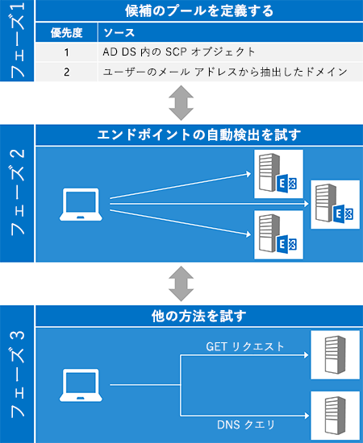
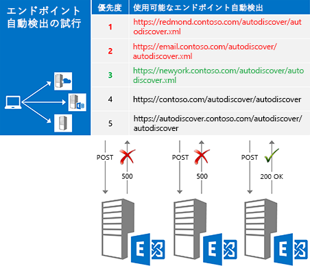

# Exchange の自動検出

Exchange 自動検出サービスについて説明します。
  
Exchange 自動検出サービスは、最小限のユーザー入力でカスタムのクライアント アプリケーションが構成されるようにするための簡単な方法を提供します。ほとんどのユーザーは、自分の電子メール アドレスとパスワードを知っています。それら 2 つの情報の断片によって、稼働に必要なその他の詳細のすべてを取得できます。Exchange Web サービス (EWS) クライアントの場合、通常、自動検出は EWS エンドポイント URL を見つけるために使用されますが、その他のプロトコルを使用するクライアントを構成する情報も自動検出によって得られます。自動検出は、ファイアウォールの内側または外側のクライアント アプリケーションに有効であり、リソース フォレストおよび複数フォレストのシナリオで動作します。
  
## 自動検出プロセスの概要

自動検出プロセスには、基本的に 3 つのフェーズがあります。フェーズ 1 では潜在的な自動検出サーバーの一覧を生成して、フェーズ 2 では成功の応答 (可能な場合) が得られるまで一覧の各サーバーを試します。いずれの候補もうまくいかなかった場合は、フェーズ 3 に移行します。このフェーズは、自動検出エンドポイントを見つけるための「最後の努力」を表します。
  
EWS マネージ API の [ExchangeService.AutodiscoverUrl](https://msdn.microsoft.com/library/microsoft.exchange.webservices.data.exchangeservice.autodiscoverurl%28v=exchg.80%29.aspx) メソッドにより、このプロセスの 3 つのフェーズはすべて実装されます。そのため、EWS マネージ API を使用する場合は、独自に自動検出を実装することについて心配する必要はありません。 次の図は、自動検出プロセスの 3 つのフェーズを示しています。 
  
**図 1. 自動検出プロセスの 3 つのフェーズ**

  
### フェーズ 1: 候補プールを定義する

自動検出を使用するには、まず、ユーザーに正しい自動検出サーバーの場所を示す必要があります。好都合なことに、自動検出の定義により、探す場所の数は限られています。複数の候補が見つかった場合、自動検出では[一覧の生成して優先度を設定する方法](how-to-generate-a-list-of-autodiscover-endpoints.md)も定義されています。
  
**表 1. 自動検出エンドポイント候補のソース**

|**探す場所**|**見つかるもの**|
|:-----|:-----|
|Active Directory Domain Services (AD DS)    |ドメインに参加しているクライアントの場合は、最初に探す場所になります。Exchange は AD DS にサービス接続ポイント (SCP) オブジェクトを公開します。これにより、自動検出の要求は Active Directory サイトに基づいてサーバーにルーティングできるようになります。[SCP 検索](how-to-find-autodiscover-endpoints-by-using-scp-lookup-in-exchange.md)の結果は、候補一覧の最上位にする必要があります。  **注**: SCP 検索は、ドメインに参加していないクライアントや Active Directory サーバーにアクセスできないクライアントには使用できません。 この場合は、SCP 検索を省略する必要があります。  |
|ユーザーの電子メール アドレス ドメイン    | 自動検出では、標準エンドポイント URL の形式が 2 つ定義されています。これは、ユーザーの電子メール アドレスのドメイン部分から派生します。   `"https://" + domain + "/autodiscover/autodiscover" +  *fileExtension*`   `"https://autodiscover." + domain + "/autodiscover/autodiscover" +  *fileExtension*`    *fileExtension* の値は、自動検出のアクセス方式に [SOAP](https://msdn.microsoft.com/library/61c21ea9-7fea-4f56-8ada-bf80e1e6b074%28Office.15%29.aspx) と [POX](https://msdn.microsoft.com/library/877152f0-f4b1-4f63-b2ce-924f4bdf2d20%28Office.15%29.aspx) のどちらを使用しているかによって決まります。 SOAP サービスではファイル拡張子 ".svc" が使用され、POX では ".xml" が使用されます。    |
   
次の図は、自動検出エンドポイント一覧の生成方法を示しています。
  
**図 2. 自動検出エンドポイント一覧の生成プロセス**

  
### フェーズ 2: 各候補を試してみる

潜在的な候補の順序付き一覧を生成したら、[URL に要求を送信](how-to-get-user-settings-from-exchange-by-using-autodiscover.md)して結果を検証することで、一覧の各候補を試してみます。図 3 を参照してください。成功の応答が得られた時点で完了です。 
  
**図 3. 各エンドポイント候補を順に試す**

  
候補に要求を送信する前に、その候補が信頼可能であることを確認します。ユーザーの資格情報を送信することを忘れてはいけません。その情報の共有は信頼できるサーバーに限定することが重要です。少なくとも、次の事項を確認する必要があります。
  
- エンドポイントが HTTPS エンドポイントであること。クライアント アプリケーションは、非 SSL エンドポイントに対して認証やデータの送信を行ってはいけません。
    
- サーバーが提示した SSL 証明書が信頼された機関からのものであり有効であること。
    
> [!NOTE]
> これらは、基本的なセキュリティの推奨事項にすぎません。認証を扱うときには、コードが組織のセキュリティ要件を満たしていることを常に確認します。 
  
送信する要求の種類は、自動検出サービスにアクセスする方法によって決まります。
  
**表 2. 自動検出の要求の種類**

|**使用するもの**|**要求を送信する手段**|
|:-----|:-----|
|EWS マネージ API    |[GetUserSettings](https://msdn.microsoft.com/library/microsoft.exchange.webservices.autodiscover.autodiscoverservice.getusersettings%28v=exchg.80%29.aspx) メソッド。    |
|SOAP 自動検出サービス    |[GetUserSettings](https://msdn.microsoft.com/library/758d965c-ef63-4de4-9120-e293abf14ff8%28Office.15%29.aspx) 操作。    |
|POX 自動検出サービス    |[自動検出要求本文](https://msdn.microsoft.com/library/75671b1d-f35b-497b-8d8c-706f3f2535fd%28Office.15%29.aspx)が含まれる HTTP POST。    |
   
### フェーズ 3: その他の方法を試す

一覧に含まれるすべてのエンドポイントを試してみたときに、それらすべてがエラーを返すことがあります。あきらめる前に、いくつか別のものを試してみることができます。認証されていない GET 要求を送信したり、SRV レコードについて DNS を照会したりできます。これらの試行でも成果が得られない場合は、自動検出サービスに接続できません。
  
**図 4. その他の方法を試す**

  
#### 認証されていない GET 要求の送信

最初に試してみることは、ユーザーの電子メール アドレスから派生したエンドポイントに向けて、認証されていない GET 要求を送信することです。 そのエンドポイントは、"http://autodiscover" + domain + "/autodiscover/autodiscover.xml" の形式です。 これは SSL エンドポイントでない点に注意してください。 サーバーが 302 リダイレクト応答を返す場合は、その応答の Location ヘッダーに含まれるエンドポイント URL に向けて[自動検出要求の再送信](handling-autodiscover-error-messages.md#bk_ResendRequest)を試してみます。 
  
#### SRV レコードについての DNS の照会

認証されていない GET 要求が失敗した場合に、最後に試してみることは、自動検出サービスに関する SRV レコードに対する DNS クエリです。このレコードは、"_autodiscover._tcp." + ドメインの形式になります。このクエリは複数のレコードを返すことがありますが、最高の優先度と重みが付けられた SSL エンドポイントをポイントするレコードのみを使用します。
  
## 自動検出を使用する場合のオプション

自動検出には、SOAP Web サービスまたは POX Web サービスを使用してアクセスできます。どのメソッドを使用するかは、要件と環境に応じて決まります。ただし、可能であれば SOAP Web サービスの使用をお勧めします。EWS マネージ API も選択肢の 1 つになります。これにより、SOAP と POX の両方の自動検出サービスのクライアント部分が実装されます。
  
**表 3: 自動検出にアクセスする場合のオプション**

|**オプション**|**利点**|**欠点**|
|:-----|:-----|:-----|
|[EWS マネージ API](get-started-with-ews-managed-api-client-applications.md)   | 自動検出プロセスが実装される。  SOAP と POX の両方の自動検出サービスを使用する。  Exchange Online、Office 365 の一部としての Exchange Online、または Exchange 2007 SP1 以降の Exchange の各バージョンで動作する。  使いやすい。    | [Microsoft.Exchange.WebServices.Autodiscover.UserSettingName](https://msdn.microsoft.com/library/microsoft.exchange.webservices.autodiscover.usersettingname%28v=EXCHG.80%29.aspx) 列挙体で使用できるユーザー設定に制限される。  .NET Framework アプリケーションにのみ使用できる。    |
|[SOAP 自動検出](https://msdn.microsoft.com/library/61c21ea9-7fea-4f56-8ada-bf80e1e6b074%28Office.15%29.aspx)   | プラットフォームに依存しない。  監視のある設定のみを要求できる。    | Exchange 2007 では使用できない。    |
|[POX 自動検出](https://msdn.microsoft.com/library/877152f0-f4b1-4f63-b2ce-924f4bdf2d20%28Office.15%29.aspx)   | プラットフォームに依存しない。  Exchange Online および Exchange 2007 SP1 以降のすべてのバージョンでサポートされる。    | 特定の設定を要求できない。    |
   
## このセクションの内容

- [Exchange の SCP 参照を使用して自動検出エンドポイントを見つける](how-to-find-autodiscover-endpoints-by-using-scp-lookup-in-exchange.md)
    
- [自動検出エンドポイントの一覧を生成する](how-to-generate-a-list-of-autodiscover-endpoints.md)
    
- [自動検出を使用して接続ポイントを検索する](how-to-use-autodiscover-to-find-connection-points.md)
    
- [自動検出を使用して Exchange からユーザー設定を取得する](how-to-get-user-settings-from-exchange-by-using-autodiscover.md)
    
- [Exchange サーバーからドメイン設定を取得する](how-to-get-domain-settings-from-an-exchange-server.md)
    
- [自動検出を使用して構成情報を更新する](how-to-refresh-configuration-information-by-using-autodiscover.md)
    
- [自動検出のエラー メッセージを処理する](handling-autodiscover-error-messages.md)
    
- [Exchange の自動検出を使用するときにパフォーマンスを向上させる](improving-performance-when-using-autodiscover-for-exchange.md)
    
## 関連項目

- [Exchange で Web サービスの使用を開始する](start-using-web-services-in-exchange.md)    
- [Exchange 2013: 自動検出によるユーザー設定の取得](https://code.msdn.microsoft.com/Exchange-2013-Get-user-7e22c86e)
- [Autodiscover Checker サンプル](https://code.msdn.microsoft.com/exchange/Autodiscover-Checker-e1ebca42)  
- [Exchange の Web サービス クライアントを開発する](develop-web-service-clients-for-exchange.md)
    

