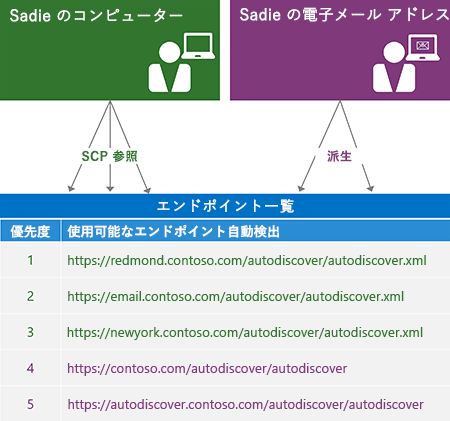

# Exchange の自動検出

Exchange 自動検出サービスについて説明します。
  
Exchange 自動検出サービスは、最小限のユーザー入力でカスタムのクライアント アプリケーションが構成されるようにするための簡単な方法を提供します。ほとんどのユーザーは、自分の電子メール アドレスとパスワードを知っています。それら 2 つの情報の断片によって、稼働に必要なその他の詳細のすべてを取得できます。Exchange Web サービス (EWS) クライアントの場合、通常、自動検出は EWS エンドポイント URL を見つけるために使用されますが、その他のプロトコルを使用するクライアントを構成する情報も自動検出によって得られます。自動検出は、ファイアウォールの内側または外側のクライアント アプリケーションに有効であり、リソース フォレストおよび複数フォレストのシナリオで動作します。
  
## 自動検出プロセスの概要

自動検出プロセスには、基本的に 3 つのフェーズがあります。フェーズ 1 では潜在的な自動検出サーバーの一覧を生成して、フェーズ 2 では成功の応答 (可能な場合) が得られるまで一覧の各サーバーを試します。いずれの候補もうまくいかなかった場合は、フェーズ 3 に移行します。このフェーズは、自動検出エンドポイントを見つけるための「最後の努力」を表します。
  
EWS のマネージ API では、 [ExchangeService.AutodiscoverUrl](http://msdn.microsoft.com/en-us/library/microsoft.exchange.webservices.data.exchangeservice.autodiscoverurl%28v=exchg.80%29.aspx)メソッドは、このプロセスのすべての 3 つのフェーズを実装するため自分で自動検出を実装することについて心配する必要がある、EWS のマネージ API を使用する場合。 次の図は、自動検出プロセスの 3 つのフェーズを示しています。 
  
**図 1 です。自動検出プロセスの 3 つのフェーズ**

  
### フェーズ 1:候補プールを定義する

自動検出を使用することができます、前に、ユーザーの適切な自動検出サーバーを検索する必要があります。 幸運にも、自動検出では、限られた場所を検索する場所を定義します。 自動検出では複数の候補がある場合[を生成し、リストの優先順位を設定する方法](how-to-generate-a-list-of-autodiscover-endpoints.md)も定義します。
  
**表 1: 自動検出エンドポイント候補のソース**

|**参照**|**どのようなことがわかります**|
|:-----|:-----|
|Active Directory ドメイン サービス (AD DS)    |クライアントがドメインに参加している、これは、検索する最初の場所です。 Exchange では、自動検出要求をサーバーにルーティングするが、AD DS で (SCP) オブジェクトが Active Directory サイトに基づくサービスの接続ポイントを公開します。 [SCP の検索](how-to-find-autodiscover-endpoints-by-using-scp-lookup-in-exchange.md)の結果は、[候補] ボックスの一覧の上部にあるはずです。    **注**: SCP 検索はドメインに参加していない、または Active Directory サーバーへのアクセス権を持っていないクライアントは使用できません。 この例では、SCP の参照を省略してください。  |
|ユーザーの電子メール アドレス ドメイン    | 自動検出では、標準エンドポイント URL の形式が 2 つ定義されています。これは、ユーザーの電子メール アドレスのドメイン部分から派生します。   `"https://" + domain + "/autodiscover/autodiscover" +  *fileExtension*`   `"https://autodiscover." + domain + "/autodiscover/autodiscover" +  *fileExtension*`    *FileExtension*の値は、自動検出のアクセス方法を使用して、 [SOAP](http://msdn.microsoft.com/library/61c21ea9-7fea-4f56-8ada-bf80e1e6b074%28Office.15%29.aspx)または[POX](http://msdn.microsoft.com/library/877152f0-f4b1-4f63-b2ce-924f4bdf2d20%28Office.15%29.aspx)によって異なります。 SOAP サービスを使用して、".svc"ファイルの拡張子です。POX は".xml"を使用します。    |
   
次の図は、自動検出エンドポイント一覧の生成方法を示しています。
  
**図 2 になります。自動検出エンドポイントのリストを生成するためのプロセス**

  
### フェーズ 2:各候補を試してみる

潜在的な候補者の順序付きリストを生成した後、次の手順は[URL に要求を送信すること](how-to-get-user-settings-from-exchange-by-using-autodiscover.md)によってリスト内の各 1 を実行してくださいし、図 3 に示すように、結果を検証しています。 正常な応答を取得する場合、完了です。 
  
**図 3 です。順序で各端点の候補をしようとしてください。**

  
候補に要求を送信する前に、その候補が信頼可能であることを確認します。ユーザーの資格情報を送信することを忘れてはいけません。その情報の共有は信頼できるサーバーに限定することが重要です。少なくとも、次の事項を確認する必要があります。
  
- エンドポイントが HTTPS エンドポイントであること。クライアント アプリケーションは、非 SSL エンドポイントに対して認証やデータの送信を行ってはいけません。
    
- サーバーが提示した SSL 証明書が信頼された機関からのものであり有効であること。
    
> [!NOTE]
> これらは、基本的なセキュリティの推奨事項にすぎません。認証を扱うときには、コードが組織のセキュリティ要件を満たしていることを常に確認します。 
  
送信する要求の種類は、自動検出サービスにアクセスする方法によって決まります。
  
**表 2 になります。自動検出要求の種類**

|**使用している場合.**|**使用して要求を送信してください.**|
|:-----|:-----|
|EWS マネージ API    |[GetUserSettings](http://msdn.microsoft.com/en-us/library/microsoft.exchange.webservices.autodiscover.autodiscoverservice.getusersettings%28v=exchg.80%29.aspx)メソッドです。    |
|SOAP 自動検出サービス    |[GetUserSettings](http://msdn.microsoft.com/library/758d965c-ef63-4de4-9120-e293abf14ff8%28Office.15%29.aspx)操作します。    |
|POX 自動検出サービス    |[自動検出要求の本文](http://msdn.microsoft.com/library/75671b1d-f35b-497b-8d8c-706f3f2535fd%28Office.15%29.aspx)を含む HTTP POST します。    |
   
### フェーズ 3:その他の方法を試す

一覧に含まれるすべてのエンドポイントを試してみたときに、それらすべてがエラーを返すことがあります。あきらめる前に、いくつか別のものを試してみることができます。認証されていない GET 要求を送信したり、SRV レコードについて DNS を照会したりできます。これらの試行でも成果が得られない場合は、自動検出サービスに接続できません。
  
**図 4 です。他の方法をしようとしてください。**

  
#### 認証されていない GET 要求の送信

ユーザーの電子メール アドレスから派生したエンドポイントを認証されていない GET 要求を送信するは、まず最初に実行してください。 そのエンドポイントの形式は、"http://autodiscover.」 + ドメイン +"/autodiscover/autodiscover.xml"です。 SSL エンドポイントではないことに注意してください。 サーバーでは、302 リダイレクト応答が返された場合ことができますし、しようとする応答の Location ヘッダーにエンドポイントの URL に[自動検出の要求を再送信](handling-autodiscover-error-messages.md#bk_ResendRequest)をします。 
  
#### SRV レコードについての DNS の照会

認証されていない GET 要求が失敗した場合に、最後に試してみることは、自動検出サービスに関する SRV レコードに対する DNS クエリです。このレコードは、"_autodiscover._tcp." + ドメインの形式になります。このクエリは複数のレコードを返すことがありますが、最高の優先度と重みが付けられた SSL エンドポイントをポイントするレコードのみを使用します。
  
## 自動検出を使用する場合のオプション

自動検出には、SOAP Web サービスまたは POX Web サービスを使用してアクセスできます。どのメソッドを使用するかは、要件と環境に応じて決まります。ただし、可能であれば SOAP Web サービスの使用をお勧めします。EWS マネージ API も選択肢の 1 つになります。これにより、SOAP と POX の両方の自動検出サービスのクライアント部分が実装されます。
  
**表 3: 自動検出にアクセスする方法**

|**オプション**|**プロフェッショナル**|**短所**|
|:-----|:-----|:-----|
|[EWS Managed API](get-started-with-ews-managed-api-client-applications.md)   | 自動検出プロセスが実装される。  SOAP と POX の両方の自動検出サービスを使用する。  Exchange Online、Office 365 の一部としての Exchange Online、または Exchange 2007 SP1 以降の Exchange の各バージョンで動作する。  使いやすい。    | [Microsoft.Exchange.WebServices.Autodiscover.UserSettingName](http://msdn.microsoft.com/en-us/library/microsoft.exchange.webservices.autodiscover.usersettingname%28v=EXCHG.80%29.aspx)列挙体で使用可能なユーザーの設定に制限されます。  .NET Framework アプリケーションにのみ使用できる。    |
|[SOAP の自動検出](http://msdn.microsoft.com/library/61c21ea9-7fea-4f56-8ada-bf80e1e6b074%28Office.15%29.aspx)   | プラットフォームに依存しない。  監視のある設定のみを要求できる。    | Exchange 2007 では使用できない。    |
|[POX の自動検出](http://msdn.microsoft.com/library/877152f0-f4b1-4f63-b2ce-924f4bdf2d20%28Office.15%29.aspx)   | プラットフォームに依存しない。  Exchange Online および Exchange 2007 SP1 以降のすべてのバージョンでサポートされる。    | 特定の設定を要求できない。    |
   
## このセクションの内容

- [Exchange SCP のルックアップを使用して自動検出エンドポイントを検索します。](how-to-find-autodiscover-endpoints-by-using-scp-lookup-in-exchange.md)
    
- [自動検出エンドポイントの一覧を生成します。](how-to-generate-a-list-of-autodiscover-endpoints.md)
    
- [自動検出を使用してコネクション ポイントを検索するには](how-to-use-autodiscover-to-find-connection-points.md)
    
- [Exchange から自動検出を使用してユーザー設定を取得します。](how-to-get-user-settings-from-exchange-by-using-autodiscover.md)
    
- [Exchange サーバーからドメインの設定を取得します。](how-to-get-domain-settings-from-an-exchange-server.md)
    
- [自動検出を使用して構成情報を更新します。](how-to-refresh-configuration-information-by-using-autodiscover.md)
    
- [自動検出のエラー メッセージの処理](handling-autodiscover-error-messages.md)
    
- [Exchange の自動検出を使用する場合は、パフォーマンスを向上させる](improving-performance-when-using-autodiscover-for-exchange.md)
    
## 関連項目

- [Exchange で Web サービスの使用を開始する](start-using-web-services-in-exchange.md)    
- [Exchange 2013: 自動検出とユーザー設定を取得します。](http://code.msdn.microsoft.com/Exchange-2013-Get-user-7e22c86e)
- [自動検出チェック サンプル](http://code.msdn.microsoft.com/exchange/Autodiscover-Checker-e1ebca42)  
- [Exchange の Web サービス クライアントを開発する](develop-web-service-clients-for-exchange.md)
    

