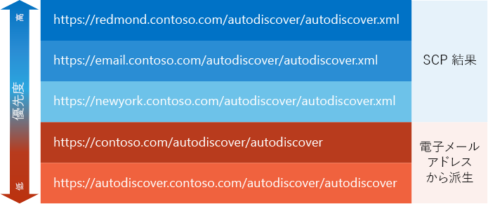

# 自動検出エンドポイントの一覧を生成する

自動検出エンドポイントの優先順位を付けた一覧を生成する方法について説明します。
  
[自動検出プロセス](autodiscover-for-exchange.md)の最初のタスクは、アプリケーションが試用する自動検出エンドポイントの一覧を生成することです。 これらの自動検出エンドポイントは、[SCP 参照](how-to-find-autodiscover-endpoints-by-using-scp-lookup-in-exchange.md)で見つけるか、ユーザーのメール アドレスから派生します。 最終的に、たくさんのエンドポイントが存在する結果になる場合があります。 優先度ごとに整理する方法を見てみましょう。 
  
## SCP 参照から始める

[SCP 参照](how-to-find-autodiscover-endpoints-by-using-scp-lookup-in-exchange.md)で見つかる自動検出エンドポイントは、一覧での優先度が最上位になります。 管理者は、クライアントを最も近い自動検出エンドポイントまたは最も効率的なエンドポイントにルーティングするよう SCP オブジェクトを構成できるので、これらのエンドポイントから始めることをお勧めします。 SCP 参照プロセスには独自の優先度スキーマがあるため、SCP 参照の結果は次の順位で既に優先度が設定されています。 
  
1. クライアント コンピューターが属する Active Directory サイトを対象とする SCP オブジェクトからの自動検出エンドポイント。
    
2. Active Directory サイトのいずれをも対象としない SCP オブジェクトからの自動検出エンドポイント。
    
3. クライアント コンピューターが属するサイトとは別の Active Directory サイトを対象とする SCP オブジェクトからの自動検出エンドポイント。
    
SCP 参照プロセスの結果を取得したら、ユーザーのメール アドレスから派生するエンドポイントを追加できます。 これらのエンドポイントは、既定のエンドポイントのセットおよび、SCP の結果がない、または SCP 参照から返されたエンドポイントが不十分な場合のフォールバックとして使用できます。
  
## ユーザーのメール アドレスから派生したエンドポイントを追加する

SCP 参照が動作しない場合、または SCP 参照によって返されたエンドポイントが正常な応答を返さない場合、ユーザーのメール アドレスから既定の自動検出エンドポイントのセットを得ることができます。これらのエンドポイントは SCP 参照からのどのエンドポイントよりも優先度は低くなりますが、SCP 参照が失敗する場合に必要になる可能性があります。
  
### 自動検出エンドポイントを取得する方法

1. ユーザーのメール アドレスからドメイン名を抽出します。たとえば、ユーザーのメール アドレスが Sadie.Daniels@contoso.com である場合、ドメイン名は contoso.com になります。
    
2. ファイル拡張子を持たないエンドポイント URL を、次の形式で作成します。
    
  - "https://" + ドメイン + "/autodiscover/autodiscover"
    
  - "https://autodiscover." + ドメイン + "/autodiscover/autodiscover"
    
SCP 参照とユーザーのメール アドレスの両方から派生するエンドポイント URL の一覧をコンパイルすると、[SOAP 自動検出 Web サービス](http://msdn.microsoft.com/library/61c21ea9-7fea-4f56-8ada-bf80e1e6b074%28Office.15%29.aspx)または [POX 自動検出 Web サービス](http://msdn.microsoft.com/library/877152f0-f4b1-4f63-b2ce-924f4bdf2d20%28Office.15%29.aspx)を使用しているかどうかによって、それらの URL のファイル名拡張子を変更する必要が生じる場合があります。
  
## エンドポイント URL のファイル名拡張子を追加または置き換える

自動検出サービスにアクセスするには、SOAP 自動検出 Web サービスまたは POX 自動検出 Web サービスを使用します。各サービスでは、類似したエンドポイント URL (ファイル名拡張子だけが異なる) が使用されます。SOAP 自動検出 Web サービスでは ".svc" ファイル名拡張子が使用され、POX 自動検出 Web サービスでは ".xml" ファイル名拡張子が使用されます。
  
既定では、SCP 参照から返された自動検出エンドポイント URL は POX URL です。ただし、SOAP 自動検出を使用している場合は、ファイル名拡張子を ".xml" から ".svc" に変更するだけで、SOAP 要求を試行できます。
  
派生した自動検出エンドポイント URL の場合、ファイル拡張子は省略されています。URL を試用する前に、使用中の自動検出 Web サービスに適切なファイル拡張子を追加します。
  
## 例: 自動検出エンドポイントの一覧を生成する

例を見てみましょう。Sadie Daniels (Sadie.Daniels@contoso.com) は、Exchange Web サービス (EWS) アプリケーションを初めて使用しています。アプリケーションでは、アプリケーション自体を構成するのに自動検出を使用します。Sadie のコンピューターは、contoso.com ドメインに参加し、Redmond Active Directory サイトにあります。アプリケーションでは、図 1 に示すように自動検出エンドポイントの一覧が生成されます。
  
**図 1: 自動検出エンドポイントのサンプルの一覧**

  
この例の EWS アプリケーションでは SOAP 自動検出 Web サービスが使用されるため、SCP 結果のファイル名拡張子を ".svc" に変更してから SOAP 要求を送信します。
  
## 次の手順

自動検出エンドポイントの一覧を生成したら、[それらのエンドポイントに要求を送信する](how-to-get-user-settings-from-exchange-by-using-autodiscover.md)ことによって試用します。
  
## 関連項目

- [Exchange の自動検出](autodiscover-for-exchange.md)
    
- [Exchange の SCP 参照を使用して自動検出エンドポイントを見つける](how-to-find-autodiscover-endpoints-by-using-scp-lookup-in-exchange.md)
    
- [自動検出のエラー メッセージの処理](handling-autodiscover-error-messages.md)
    

