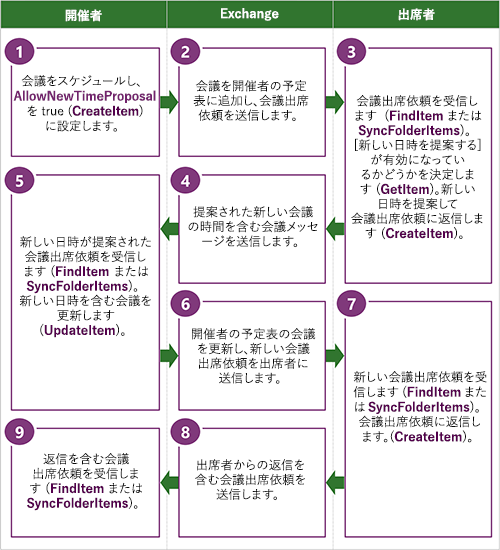

# <a name="propose-a-new-meeting-time-by-using-ews-in-exchange"></a>Exchange EWS を使用して、会議の新しい日時を提案します。

Exchange で EWS を使用して Exchange クライアント アプリケーションから新しい会議日時を提案する方法について説明します。
  
出席者は、新しい日時を提案する機能を使用して、新しい会議日時を Exchange 予定表ワークフローの一部として会議開催者に提案できます。出席者が新しい会議を提案すると、開催者は提案された新しい会議日時を使用して会議を更新し、最新情報をすべての出席者に送信できます。新しい会議日時を出席者が提案できるようにするためには、新しい日時の提案を開催者が許可しているかどうかを確認しておく必要があります。この記事では、新しい日時を提案できるかどうかを確認する方法、および EWS を使用して新しい日時を提案する方法について説明します。
  
> [!NOTE]
> EWS マネージ API はこの機能を実装していません。 
  
## <a name="determine-whether-you-can-propose-a-new-time-for-a-meeting-by-using-ews"></a>EWS を使用して会議の新しい日時を提案できるかどうかを確認する
<a name="bk_Determine"> </a>

会議の新しい日時を提案するためには、その会議への参照を見つけ、新しい日時の提案をサポートするように会議開催者が会議を構成しているかどうかを確認しておく必要があります。会議への参照は、次のいずれかの方法で取得できます。  
  
- 受信トレイで会議出席依頼を見つける
    
- 予定表で予定を見つける
    
会議の参照を見つけるには、次の手順を使用します。
  
1. [FindItem](http://msdn.microsoft.com/library/ebad6aae-16e7-44de-ae63-a95b24539729%28Office.15%29.aspx) EWS の操作 (またはメソッドを使用[Folder.FindItems](http://msdn.microsoft.com/en-us/library/microsoft.exchange.webservices.data.folder.finditems%28v=EXCHG.80%29.aspx) EWS マネージ API) ターゲットを検索するのには会議の依頼または予定表のアイテムです。 または、会議の依頼または予定表アイテムのターゲットの識別子を取得するのに[SyncFolderItems](http://msdn.microsoft.com/library/7f0de089-8876-47ec-a871-df118ceae75d%28Office.15%29.aspx) EWS の操作を使用できます。 
    
2. 会議アイテムの項目の識別子を取得する**FindItem**操作 (または**Folder.FindItems**メソッド) の結果を解析します。 
    
3. 会議の応答オブジェクトを取得するのにには、 [GetItem](http://msdn.microsoft.com/library/e3590b8b-c2a7-4dad-a014-6360197b68e4%28Office.15%29.aspx) EWS の操作を使用します。 
    
次の XML は、アイテムの応答オブジェクトを要求するために何が送られるかを示しています。
  
```XML
<?xml version="1.0" encoding="utf-8"?>
<soap:Envelope xmlns:xsi="http://www.w3.org/2001/XMLSchema-instance"
               xmlns:xsd="http://www.w3.org/2001/XMLSchema"
               xmlns:soap="http://schemas.xmlsoap.org/soap/envelope/"
               xmlns:t="http://schemas.microsoft.com/exchange/services/2006/types"
               xmlns:m="http://schemas.microsoft.com/exchange/services/2006/messages">
  <soap:Header>
    <t:RequestServerVersion Version="Exchange2013" />
    <t:MailboxCulture>en-US</t:MailboxCulture>
  </soap:Header>
  <soap:Body>
    <m:GetItem>
      <m:ItemShape>
        <t:BaseShape>IdOnly</t:BaseShape>
        <t:AdditionalProperties>
          <t:FieldURI FieldURI="item:ResponseObjects"/>
          <t:FieldURI FieldURI="item:Subject"/>
          <t:FieldURI FieldURI="calendar:Start"/>
          <t:FieldURI FieldURI="calendar:End"/>
        </t:AdditionalProperties>
      </m:ItemShape>
      <m:ItemIds>
        <t:ItemId Id="AAMkADEzOTExYjJkL1AAA=" ChangeKey="CwAAAB/G6X"/>
      </m:ItemIds>
    </m:GetItem>
  </soap:Body>
</soap:Envelope>
```

**GetItem**操作の応答は会議の時間に変更の提案の構成内容の変更を許可する場合と、項目 id、ミーティングの開始と終了時刻、応答オブジェクトのコレクションを要求した場合、次の XML のようななります。 [ResponseObjects](http://msdn.microsoft.com/library/ad29e064-3f3d-4b7b-aa4c-9ec27326381d%28Office.15%29.aspx)要素によって表される応答オブジェクトのコレクションには、予定表アイテムの有効な応答のセットが含まれています。 **ProposeNewTime**要素は、ユーザーが会議の新しい日時を指定できることを示す応答オブジェクトです。 [AcceptItem](http://msdn.microsoft.com/library/05a15431-77e1-411a-a16b-5481d364d3cc%28Office.15%29.aspx)、 [TentativelyAcceptItem](http://msdn.microsoft.com/library/ce6f50ef-ad8a-47e4-915a-487b2ef7a2e0%28Office.15%29.aspx)、および[DeclineItem](http://msdn.microsoft.com/library/2d8d2389-924e-4d03-a324-35d56cf0d6b1%28Office.15%29.aspx)の要素では、会議の開催者に会議の新しい日時を提案するために使用できる応答オブジェクトを表します。 
  
```XML
<s:Envelope xmlns:s="http://schemas.xmlsoap.org/soap/envelope/">
  <s:Header>
    <h:ServerVersionInfo MajorVersion="15" 
                         MinorVersion="0" 
                         MajorBuildNumber="815" 
                         MinorBuildNumber="6" 
                         Version="V2_7" 
                         xmlns:h="http://schemas.microsoft.com/exchange/services/2006/types" 
                         xmlns="http://schemas.microsoft.com/exchange/services/2006/types" 
                         xmlns:xsd="http://www.w3.org/2001/XMLSchema" 
                         xmlns:xsi="http://www.w3.org/2001/XMLSchema-instance"/>
  </s:Header>
  <s:Body xmlns:xsi="http://www.w3.org/2001/XMLSchema-instance" 
          xmlns:xsd="http://www.w3.org/2001/XMLSchema">
    <m:GetItemResponse xmlns:m="http://schemas.microsoft.com/exchange/services/2006/messages" 
                       xmlns:t="http://schemas.microsoft.com/exchange/services/2006/types">
      <m:ResponseMessages>
        <m:GetItemResponseMessage ResponseClass="Success">
          <m:ResponseCode>NoError</m:ResponseCode>
          <m:Items>
            <t:MeetingRequest>
              <t:ItemId Id="AAMkADEzOTExYjJkL1AAA=" ChangeKey="CwAAAB/G6X"/>
              <t:Subject>Competitive analysis: kick off meeting</t:Subject>
              <t:ResponseObjects>
                <t:AcceptItem/>
                <t:TentativelyAcceptItem/>
                <t:DeclineItem/>
                <t:ProposeNewTime/>
                <t:ReplyToItem/>
                <t:ReplyAllToItem/>
                <t:ForwardItem/>
              </t:ResponseObjects>
              <t:Start>2013-11-09T17:00:00Z</t:Start>
              <t:End>2013-11-09T17:30:00Z</t:End>
            </t:MeetingRequest>
          </m:Items>
        </m:GetItemResponseMessage>
      </m:ResponseMessages>
    </m:GetItemResponse>
  </s:Body>
</s:Envelope>
```

## <a name="propose-a-new-meeting-time-by-using-ews"></a>EWS を使用して新しい会議日時を提案する
<a name="bk_Propose"> </a>

**GetItem**操作を使用して予定表アイテムまたは会議出席依頼を取得するときに、 **ProposeNewTime**の応答オブジェクトを受信した場合は、提案された新しい会議の時間で応答できます。 **ProposeNewTime** response オブジェクトを受信していない、予定表のワークフローの一部として新しい会議日時を指定することはできません。 新しい会議の時間を要求するための開催者に返信することができます、ただし、します。 **ProposeNewTime** response オブジェクトを受信した場合、その識別子を参照することによって、会議に対応し、開催者に会議の新しい日時を提案できます。 これは、 **ProposeNewTime**の応答オブジェクトがオブジェクトの一般的な応答のパターンとは異なる**ProposeNewTime**の応答オブジェクトを使用して応答しないことにします。 他のいずれかを使用する会議の応答などのオブジェクト、 **AcceptItem**、 **TentativelyAcceptItem**、 **DeclineItem**、新しい会議を提案します。 この例では、 **AcceptItem**応答オブジェクトを使用します。 
  
```XML
<?xml version="1.0" encoding="UTF-8"?>
<soap:Envelope xmlns:soap="http://schemas.xmlsoap.org/soap/envelope/"
               xmlns:t="http://schemas.microsoft.com/exchange/services/2006/types"
               xmlns:m="http://schemas.microsoft.com/exchange/services/2006/messages">
  <soap:Header>
    <t:RequestServerVersion Version="Exchange2013"/>
  </soap:Header>
  <soap:Body>
    <m:CreateItem>
      <m:Items>
        <t:AcceptItem>
          <t:Body BodyType="Text">This time works better for the HiPPO.</t:Body>
          <t:ReferenceItemId Id="AAMkADEzOTExYjJkL1AAA=" ChangeKey="CwAAAB/G6X"/>
          <t:ProposedStart>2013-11-28T04:00:00Z</t:ProposedStart>
          <t:ProposedEnd>2013-11-28T04:30:00Z</t:ProposedEnd>
        </t:AcceptItem>
      </m:Items>
    </m:CreateItem>
  </soap:Body>
</soap:Envelope>
```

この要求への応答には、出席者の予定表に追加された予定表アイテムの識別子、および出席者の削除済みアイテム フォルダーに配置された会議出席依頼のコピーが含まれています。 新しい時間の提案で応答メッセージは、出席者の [送信済みアイテム フォルダーにも保存された (会議を検索する必要がある応答メッセージをそのハンドルを取得する)。
  
```XML
<s:Envelope xmlns:s="http://schemas.xmlsoap.org/soap/envelope/">
  <s:Header>
    <h:ServerVersionInfo MajorVersion="15" 
                         MinorVersion="0" 
                         MajorBuildNumber="815" 
                         MinorBuildNumber="6" 
                         Version="V2_7" 
                         xmlns:h="http://schemas.microsoft.com/exchange/services/2006/types" 
                         xmlns="http://schemas.microsoft.com/exchange/services/2006/types" 
                         xmlns:xsd="http://www.w3.org/2001/XMLSchema" 
                         xmlns:xsi="http://www.w3.org/2001/XMLSchema-instance"/>
  </s:Header>
  <s:Body xmlns:xsi="http://www.w3.org/2001/XMLSchema-instance" 
          xmlns:xsd="http://www.w3.org/2001/XMLSchema">
    <m:CreateItemResponse xmlns:m="http://schemas.microsoft.com/exchange/services/2006/messages" 
                          xmlns:t="http://schemas.microsoft.com/exchange/services/2006/types">
      <m:ResponseMessages>
        <m:CreateItemResponseMessage ResponseClass="Success">
          <m:ResponseCode>NoError</m:ResponseCode>
          <m:Items>
            <t:CalendarItem>
              <t:ItemId Id="AAMkAGRmOWE2OWAAA=" ChangeKey="DwAAJsmU"/>
            </t:CalendarItem>
            <t:MeetingRequest>
              <t:ItemId Id="AAMkAGRmOWE2AAABB=" ChangeKey="AAAGJu1A"/>
            </t:MeetingRequest>
          </m:Items>
        </m:CreateItemResponseMessage>
      </m:ResponseMessages>
    </m:CreateItemResponse>
  </s:Body>
</s:Envelope>
```

開催者はメッセージが表示される[MeetingResponse](http://msdn.microsoft.com/library/9f798e79-dafd-4d4d-9967-95fd8e5c0502%28Office.15%29.aspx)出席者が会議の提案された新しい日時を使用して応答します。 **MeetingResponse**メッセージには、提案された新しい会議が含まれています。 開催者の予定表の時刻と終了時刻、および関連付けられている予定表アイテムの識別子を開始します。 開催者は、既存の会議の予定表のアイテムを更新するのにはその情報を使用できます。 会議の新しい日時を提案する**MeetingResponse**メッセージに応答する構成内容変更のワークフローを次に示します。 
  
1. **MeetingResponse**で**ProposedStart**または**ProposedEnd**の要素が設定されているかどうかを決定します。 その場合は、手順 2 に進みます。 それ以外の場合は、 **MeetingResponse**メッセージは、出席者を承諾、仮承諾、または、会議を辞退するかどうかのみを示します。 
    
2. **AssociatedCalendarItemId**要素に返される EWS 識別子を使用して、会議の開催者の既存の予定表アイテムを取得します。 
    
3. 元の開始時刻と終了時刻を、提案された新しい会議日時と比較します。提案された新しい会議日時を開催者が受け入れることができる場合は、手順 4 に進みます。それ以外の場合、会議開催者は、提案された会議日時を無視するか、新しい会議日時を提案した出席者にメール応答を送信できます。
    
4. (省略可能)ルームとリソース メールボックスを含む、すべての出席者に対して提案された時間は動作するかどうかを確認する[GetUserAvailability](http://msdn.microsoft.com/library/8da17226-5d3a-4525-9ffa-d83730f47bb1%28Office.15%29.aspx) EWS 操作の呼び出しを実行します。 (も使えます[ExchangeService.GetUserAvailability](http://msdn.microsoft.com/en-us/library/microsoft.exchange.webservices.data.exchangeservice.getuseravailability%28v=exchg.80%29.aspx) EWS のマネージ API のメソッドをこれを行うにします。) 
    
5. 開催者は、新しい提案された会議の時間にその会議を更新し、 [UpdateItem](http://msdn.microsoft.com/library/5d027523-e0bc-4da2-b60b-0cb9fc1fdfe4%28Office.15%29.aspx) EWS 操作 (または[Appointment.Update](http://msdn.microsoft.com/en-us/library/microsoft.exchange.webservices.data.appointment.update%28v=exchg.80%29.aspx)の EWS のマネージ API のメソッド) を使用して、すべての出席者に更新を送信します。 
    
次の図は、会議開催者、出席者、および EWS 呼び出しを処理する Exchange サーバーの間で行われるプロセスを示しています。
  
**図 1 です。会議の新しい日時を提案するためのプロセス**


  
## <a name="version-differences"></a>バージョンの相違点
<a name="bk_Behavior"> </a>

新しい日時を提案する機能は、Exchange ビルド バージョン 15.00.0800.007 で導入されました。以前のバージョンの Exchange では、EWS アプリケーション ユーザーは、異なる会議日時を要求するためには、別個のメールを会議開催者に送信する必要があります。  
  
## <a name="see-also"></a>関連項目


- [Calendars and EWS in Exchange](calendars-and-ews-in-exchange.md)
    
- [Exchange 2013 の EWS を使用して予定および会議を作成します。](how-to-create-appointments-and-meetings-by-using-ews-in-exchange-2013.md)
    
- [Exchange EWS を使用して予定および会議を取得します。](how-to-get-appointments-and-meetings-by-using-ews-in-exchange.md)
    
- [Exchange EWS を使用して予定および会議を更新します。](how-to-update-appointments-and-meetings-by-using-ews-in-exchange.md)
    
- [予定を削除して、Exchange で EWS を使用して会議をキャンセル](how-to-delete-appointments-and-cancel-meetings-by-using-ews-in-exchange.md)
    

