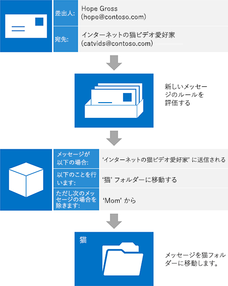

# Exchange での受信トレイの管理と EWS

受信トレイのルールと受信拒否リストを使用して、EWS Mマネージ API または EWS アプリケーションで受信トレイを管理する方法を紹介します。
  
Exchange メールボックスには、ユーザーが受信メールを自動的に整理できるようになる機能が備わっています。これらの機能はすべて、ユーザーによる操作なしでサーバー上で動作しますが、さまざまなニーズに対応できます。EWS マネージ API と EWS では、これらの機能へのアクセスが提供され、ユーザーは自分の受信トレイを管理できるようになります。
  
**表 1. 受信トレイの管理機能**

|**目的…**|**使う機能**|
|:-----|:-----|
|特定の条件 (送信者、件名、添付物など) に基づいて、受信メッセージにアクション (別のフォルダーへの移動、削除など) を行う    |受信トレイのルール    |
|特定の送信者からのすべての受信メールを削除する    |受信拒否リスト    |
   
## 受信トレイ ルール

現実問題: すべてのメールが同じように作成されているわけではありません。数年前に参加し、なかなか退会する機会がなかったインターネットのねこ動画の配布リストからのメールが、自分の上司から受け取るメールと同じ数ほどあるとします。インターネットのねこ動画は面白いですが、配布リストからのメールに使用されるトラフィック量は大きいですし、配布リストからのメールが受信トレイに大量に来るため重要なメッセージを簡単に見失ってしまう恐れがあります。多くのユーザーは、受信トレイ ルールを使用してそのようなメッセージを減らし、受信トレイをはるかに使いやすい場所にします。Exchange Web サービス (EWS) を使用すれば、アプリケーションは、制限ルールの機能を有効に活用できます。
  
EWS マネージ API では、ルールを操作するために [ExchangeService.GetInboxRules](https://msdn.microsoft.com/library/microsoft.exchange.webservices.data.exchangeservice.getinboxrules%28v=exchg.80%29.aspx) メソッドと [ExchangeService.UpdateInboxRules](https://msdn.microsoft.com/library/microsoft.exchange.webservices.data.exchangeservice.updateinboxrules%28v=exchg.80%29.aspx) メソッドが提供されます。EWS では、ルールを操作するために [GetInboxRules](https://msdn.microsoft.com/library/b4b2701a-4a23-4acc-8c75-19f7955ad7ae%28Office.15%29.aspx) 操作と [UpdateInboxRules](https://msdn.microsoft.com/library/f982a237-471e-45c5-a2b5-468cfc53150b%28Office.15%29.aspx) 操作が提供されます。ただし、EWS マネージ API と EWS には、受信トレイ ルールを操作する場合、次の制限があることにご注意ください。 
  
- EWS では、"クライアントのみ" ルール、または Outlook で設定されている "このコンピューターでのみ" 実行されるルールにアクセスしたり、作成したりすることはできません。
    
- EWS を使用して現在の一連のルールを変更するには、Outlook ルールの BLOB が存在する場合、これを削除する必要があります。これは、ルールの変更に EWS を使用すると、Outlook によって既にオフ (無効) にされていたすべてのルールが削除されることを意味します。 
    
### ルールのしくみ

ルール エンジンは、ユーザーのメールボックスに対するゲートキーパーとして機能します。ユーザーのメールボックスにメッセージが到着すると、受信トレイにメッセージが表示される前に、そのメッセージは、ルールの順序付きリストに対して評価されます。これは、到着時のみに受信トレイでのみ実行されることにご注意ください。これらのルールは、[条件](#bk_Conditions)、[アクション](#bk_Actions)、[例外](#bk_Exceptions)の 3 つの部分で構成されます。
  
ルール エンジンは、ルールの一覧の最上位のルールから開始して、最後のルールに到達するまで次の手順を実行します。
  
1. ルールで指定されたすべての条件を満しているかどうかメッセージを確認します。
    
1. メッセージがすべての条件を満たしている場合、手順 2 で評価を続行します。
    
2. そうでない場合は、ルール エンジンはルール一覧の次のルールを読み込み、手順 1 からやり直します。
    
2. ルールで指定されたいずれかの例外を満しているかどうかメッセージを確認します。
    
1. メッセージがいずれかの例外を満たしている場合、ルール エンジンはルール一覧の次のルールを読み込み、手順 1 からやり直します。
    
2. そうでない場合は、手順 3 で評価が続行されます。
    
3. ルールで指定されたアクションをメッセージに実行します。
    
1. "以降のルールは処理しない" アクションが指定されると、ルール エンジンはその他のすべてのアクションをメッセージに実行し、メッセージに対するそれ以上のルール評価を行わずに終了します。
    
2. "以降のルールは処理しない" アクションを指定しない場合は、ルール エンジンはルール一覧の次のルールを読み込み、手順 1 からやり直します。
    
ルール エンジンが実行するプロセスを次の図に示します。
  
**図 1.ルール エンジンの概要**

  
### ルールの構成要素を理解する

ルールの各部を視覚化する方法の1つは、受信メールを整理する必要があるユーザーに指示を与えることを想像することです。 この人物には、「メッセージが到着した場合はメッセージを受信しない」と言うことがあります。 \<insert conditions here\> \<insert actions here\> \<insert exceptions here\> 各パーツを詳しく見てみましょう。
  
#### 条件

[条件](https://msdn.microsoft.com/library/f049a48c-9585-43f7-8549-0b8cb19a5eea%28Office.15%29.aspx) は、ルールを適用する場合について説明します。ルールの条件は省略できます (ルールがすべての受信メッセージに適用されます) が、普通は受信メッセージのサブセットに適用される条件をルールに設定します。たとえば、"メッセージが Sadie からの場合" または "メッセージが 'ねこ動画の愛好家' の配布リストに送信される場合" などです。ルールには複数の条件を指定することができます。ルールに複数の条件がある場合、ルール エンジンが指定されたアクションを実行するためには、すべての条件が満たされる必要があります。 
  
#### アクション

[Actions](https://msdn.microsoft.com/library/c5aa96b1-2d8b-422f-8c2f-f118572ab23f%28Office.15%29.aspx) describe what happens when a rule applies. Examples are "move the message to the 'Cats' folder" or "mark the message with 'Low' importance". Rules can have multiple actions. When you specify multiple actions for a rule, all the actions are performed when the rule is applied. 
  
#### 例外

例 
  
### 例:これらのねこ動画を寄せ集める

ルールを使用してインターネットのねこ動画の配信リストからのトラフィックを削除する方法を見てみましょう。前提条件は次のとおりです。
  
- これらのメッセージは、"インターネットのねこ動画愛好家" という配布リストに送信されます。
    
- そのうちこれらのメッセージは読みたいのですが、自分の受信トレイをこれらのメッセージで散らかった状態にしたくはありません。これらのメッセージを "ねこ" というフォルダーに置きたいと考えています。
    
- 母親 が一番面白いビデオを送信してくるので、母親がこの配布リストに送信したメッセージはすぐに読みたいと思っています。
    
このためには、次のようにルール エンジンに指定します。"'インターネットのねこ動画愛好家' 配布リストに送信されるメッセージを受け取ったら、そのメッセージが 母親 からのものではない限り、'ねこ' フォルダーに移動します。" 
  
**表 2. ルールの定義**

|**ルールの構成要素**|**値**|
|:-----|:-----|
|条件    |'インターネットのねこ動画愛好家' 配布リストに送信される    |
|アクション    |メッセージを'ねこ' フォルダーに移動する、    かつ、以降のルールは処理しない    |
|Exceptions    |'母親' から    |
   
> [!NOTE]
> "以降のルールは処理しない" は、該当したルールのアクションの 1 つであることに注意してください。通常、どのルールが特定のメッセージで機能するかについての混乱を避けるため、このアクションを含めることをお勧めします。ただし、このアクションを省略しルールを適切に順序付ければ、受信メールのより高度な処理を実行できます。この場合、おそらく、インターネットのねこ動画 メッセージでは、高度な処理をあまり行わないことが安全策です。 
  
このルールの作成後、すぐに新しいメッセージが届きました。同僚の Hope が配布リストにメッセージを送信しました。ルール エンジンの機能を頭の中で実行してみると、メッセージがすべての条件を満たし ('インターネットのねこ動画愛好家' に送られ)、かつ例外のいずれも満たさない ('母親' から送信されていない) と、ルールが適用され、メッセージは 'ねこ' フォルダーに移動されます。
  
次の図は、受信メッセージにルールを適用する方法を示します。
  
**図 2. 受信メッセージがルールによって処理されます。**

  
## 送信者をブロックする

特定の送信者からのすべてのメールを迷惑メール フォルダーに移動するルールを作成できますが、これは迷惑メールのオプションで受信拒否リストを使用して行うこともできます。ユーザーが指定できるルールの数には制限があるため、受信拒否リストを使用するのが有効な方法です。[ExchangeService.MarkAsJunk](how-to-add-and-remove-email-addresses-from-blocked-senders-list-by-using-ews.md) EWS マネージ API メソッドまたは [MarkAsJunk](https://msdn.microsoft.com/library/microsoft.exchange.webservices.data.exchangeservice.markasjunk%28v=exchg.80%29.aspx) EWS 操作を使用して、 [受信拒否リストに対して特定のメール アドレスを追加または削除](https://msdn.microsoft.com/library/1f71f04d-56a9-4fee-a4e7-d1034438329e%28Office.15%29.aspx)できます。EWS が受信拒否リストにアクセスするためには、ユーザーのメールボックスに、追加または削除するメール アドレスからのメール メッセージを含める必要があります。 
  
## このセクションの内容

- [Exchange で EWS を使用して受信トレイ ルールを管理する](how-to-manage-inbox-rules-by-using-ews-in-exchange.md)
    
- [Exchange で EWS を使用して、受信拒否リストに対してメール アドレスを追加、削除する](how-to-add-and-remove-email-addresses-from-blocked-senders-list-by-using-ews.md)
    
## 関連項目

- [Exchange の Web サービス クライアントを開発する](develop-web-service-clients-for-exchange.md)
    
- [GetInboxRules の操作](https://msdn.microsoft.com/library/b4b2701a-4a23-4acc-8c75-19f7955ad7ae%28Office.15%29.aspx)
    
- [UpdateInboxRules の操作](https://msdn.microsoft.com/library/f982a237-471e-45c5-a2b5-468cfc53150b%28Office.15%29.aspx)
    
- 
  [MarkAsJunk 操作](https://msdn.microsoft.com/library/1f71f04d-56a9-4fee-a4e7-d1034438329e%28Office.15%29.aspx)
    

