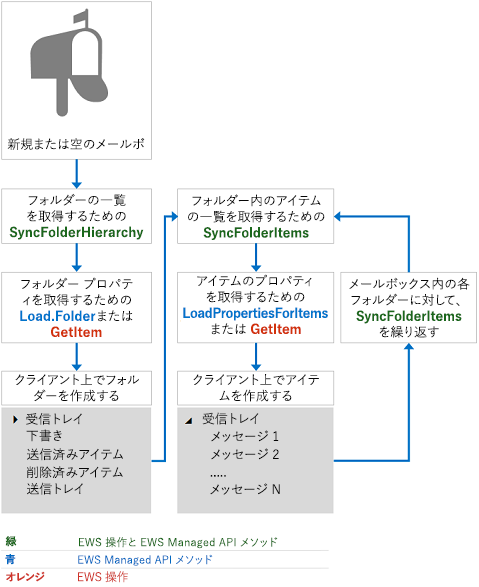

# Exchange のメールボックス同期と EWS

EWS を使用して Exchange にアクセスするときのメールボックスの同期の動作を確認します。
  
Exchange では EWS が次の 2 種類の同期を使用して、メールボックスの内容、およびその内容への変更を取得します。
  
- フォルダーの同期
    
- アイテムの同期
    
この記事では、両方の同期の種類、同期のしくみ、同期の設計パターン、および同期のベスト プラクティスについて説明します。
  
## フォルダーとアイテムの同期

フォルダーの同期では、フォルダー構造、またはフォルダー階層を同期します。アイテムの同期では、フォルダー内のアイテムを同期します。アイテムを同期するときは、メールボックス内の各フォルダーを個別に同期する必要があります。フォルダーおよびアイテムの同期を実装するには、アプリケーションに EWS または EWS マネージ API を使用できます。
  
**表 1. フォルダーとアイテムの同期のための EWS 操作と EWS マネージ API**

|**EWS 操作**|**EWS マネージ API メソッド**|
|:-----|:-----|
|[SyncFolderHierarchy](http://msdn.microsoft.com/library/b31916b1-bc6c-4451-a475-b7c5417f752d%28Office.15%29.aspx)   |[ExchangeService.SyncFolderHierarchy メソッド](http://msdn.microsoft.com/ja-JP/library/microsoft.exchange.webservices.data.exchangeservice.syncfolderhierarchy%28v=exchg.80%29.aspx)   |
|[SyncFolderItems](http://msdn.microsoft.com/library/7f0de089-8876-47ec-a871-df118ceae75d%28Office.15%29.aspx)   |[ExchangeService.SyncFolderItems メソッド](http://msdn.microsoft.com/ja-JP/library/microsoft.exchange.webservices.data.exchangeservice.syncfolderitems%28v=exchg.80%29.aspx)   |
   
発生する同期の範囲は、次のように、初期同期か、または継続している同期かによって異なります。
  
- 初期同期は、サーバー上のすべてのフォルダーまたはアイテムをクライアントに同期します。初期同期後、クライアントには、今後の同期のために格納される同期状態があります。同期状態は、サーバーがクライアントに伝えたサーバー上のすべての変更を表します。
    
- 継続的な同期では、前回の同期以降に追加、削除、または変更したアイテムまたはフォルダーを同期します。サーバーは、同期状態を使用して、それぞれの継続的な同期ループ中にクライアントに報告する変更を計算します。
    
各同期メソッドまたは操作は、変更した実際のフォルダーやメッセージではなく、変更の一覧を返します。アイテムとフォルダーへの変更は、次の種類の変更を使用して報告されます。
  
- 作成 — クライアント上で新しく作成する必要のあるアイテムまたはフォルダーを示します。
    
- 更新 — クライアント上で変更する必要のあるアイテムまたはフォルダーを示します。
    
- 削除 — クライアント上で削除する必要のあるアイテムまたはフォルダーを示します。
    
- EWS 用の ReadStateChange、または EWS マネージ API 用のReadFlagChange — アイテムの読み取り状態が未読から開封済み、または開封済みから未読になったことを示します。
    
Exchange Online、Office 365 の一部としての Exchange Online、および Exchange 2010 SP2 以降のバージョンの Exchange では、アイテムおよびフォルダーは最も新しいものから古いものの順で返されます。以前のバージョンの Exchange では、アイテムとフォルダーは最も古いものから新しいものの順で返されます。
  
## EWS の同期のしくみについて

簡単に言うと、最初にメールボックスの同期をとる場合は、図 1 に示すプロセスを使用します。 その他の[同期の設計パターン](mailbox-synchronization-and-ews-in-exchange.md#bk_syncpatterns)も使用できますが、拡張性の高いアプリケーションには、この方法をお勧めします。
  
**図 1. 初期同期の設計パターン**

  
クライアントの既存の同期状態を使用してメールボックスを同期するには、図 2 に示す設計パターンを実装することをお勧めします。 
  
**図 2. 継続的な同期の設計パターン**

  
## 同期の設計パターン

アプリケーションでは、通知ベースの同期、または同期のみの 2 つの方法のうち、いずれかの同期の設計パターンをアプリケーションに使用して、メールボックスを最新に保つことができます。
  
[図 2](mailbox-synchronization-and-ews-in-exchange.md#bk_howdoesitwork) に示すとおり、通知ベースの同期は、EWS マネージ API の [SyncFolderItems](http://msdn.microsoft.com/ja-JP/library/microsoft.exchange.webservices.data.exchangeservice.syncfolderitems%28v=exchg.80%29.aspx) または [SyncFolderHierarchy](http://msdn.microsoft.com/ja-JP/library/microsoft.exchange.webservices.data.exchangeservice.syncfolderhierarchy%28v=exchg.80%29.aspx) メソッド、あるいは EWS の [SyncFolderHierarchy](http://msdn.microsoft.com/library/b31916b1-bc6c-4451-a475-b7c5417f752d%28Office.15%29.aspx) または [SyncFolderItems](http://msdn.microsoft.com/library/7f0de089-8876-47ec-a871-df118ceae75d%28Office.15%29.aspx) 操作を呼び出すために、クライアントに警告する通知に依存します。 このタイプの同期は一般に、スケーラブルなアプリケーションに推奨されますが、いつでも最適であるとは限りません。 通知ベースの同期には、次の利点があります。 
  
- 通知は、バックエンドの Exchange データベースへの呼び出しを減らすために最適化されています。 イベント キューとサブスクリプションは、メールボックス サーバー (または Exchange 2010 および Exchange 2007 の Client Access サーバー) で管理されますが、イベントとサブスクリプションの管理では、Exchange データベースへの同期の呼び出し頻度の高い他の管理方法よりも、使用するリソースが少なくて済みます。 また、Exchange には、通知とサブスクリプションに固有の[調整ポリシー](ews-throttling-in-exchange.md)があり、リソースの消費量を保護します。 
    
ただし、通知ベースの同期を使用する場合にもいくつかの欠点はあります。
  
- 通知はほとんどのシナリオで、1 つのユーザーの目的に対して複数の通知が必要になるため、わずらわしい場合があります。 これは特に、予定表フォルダーに当てはまります。 たとえば、1 つの会議出席依頼を受信すると、アイテムを作成する通知とアイテムを変更する通知を含め、複数のアイテムおよびフォルダーの通知が作成されます。 このような欠点を軽減するには、[Load](http://msdn.microsoft.com/ja-JP/library/microsoft.exchange.webservices.data.serviceobject.load%28v=exchg.80%29.aspx)、[LoadPropertiesForItems](http://msdn.microsoft.com/ja-JP/library/microsoft.exchange.webservices.data.exchangeservice.loadpropertiesforitems%28v=exchg.80%29.aspx)、[GetItem](http://msdn.microsoft.com/ja-JP/library/exchange/aa565934%28v=exchg.150%29.aspx.aspx)、[GetFolder](http://msdn.microsoft.com/ja-JP/library/exchange/aa580274%28v=exchg.150%29.aspx.aspx) の呼び出しに数秒の遅延を設定する方法があります。 会議出席依頼の場合、すぐに **GetItem** 操作を呼び出すと、呼び出しはアイテムの作成とアイテムの変更の 2 つになる可能性があります。 代わりに、呼び出しを遅延させると、1 回の **GetItem** 操作の呼び出しで、アイテムの作成と修正を同時に含む変更を取得できます。 
    
- 通知はメールボックス サーバー上のキューに置かれ、サブスクリプションはメールボックス サーバーに保存されます。 サブスクリプションを管理するメールボックス サーバーが使用できない場合は、新しい通知が失われ、メールボックスは同期されないため、通知にサブスクライブし直さなければならなくなります。
    
- 通知が失敗した場合の軽減対策を計画する必要があります。 このように、2 番目の方法である同期専用の設計パターンの方が、通知ベースの同期よりも弾力性があります。これは、クライアントが同期状態を維持するだけで済み、サブスクリプションを管理するメールボックス サーバーに対するアフィニティの問題がないためです。
    
推奨どおりに実装されている場合、通知ベースのサブスクリプション設計パターンは以下のものに依存します。 
  
- データが*いつ*変更されたかを確認する通知。 
    
- 返される同期イベントの数を最適化して、*何が*変更されたかを判別するための EWS マネージ API の **SyncFolderHierarchy** メソッドまたは **SyncFolderItems** メソッド、あるいは EWS の **SyncFolderHierarchy** 操作または **SyncFolderItems** 操作。 新しいアイテムが作成、更新、または削除されたかどうか。 これらのメソッドから知る必要のあるものはこれですべてです。変更したプロパティの一覧については、それらに依存しないでください (返されるアイテムまたはフォルダーのすべてに対して、**GetItem** や **LoadPropertiesForItems** を呼び出さないでください)。 
    
- EWS マネージ API で **Load** または **LoadPropertiesForItems** メソッドを使用するか、EWS の **GetItem** 操作を使用して、*どのように*データが変更されたかを確認し、必要に応じてサーバーからプロパティを取得します。その際、返されるデータ量に基づいてバッチ要求を整理します。 その後、クライアントのプロパティとサーバーから返されたプロパティが比較され、最終的に、クライアントのアイテムまたはフォルダーが作成、削除、または変更されます。 
    
同期のみのアプローチは、EWS マネージ API の **SyncFolderItems** メソッドと **SyncFolderHierarchy** メソッド、または EWS の **SyncFolderHierarchy** 操作または **SyncFolderItems** 操作に全面的に依存しています。それらは、連続して呼び出すか、またはタイミングを指定したイベントとして呼び出すことができます。 このオプションにも一長一短があります。 同期のみの方法は、同期状態がメールボックス レベルでクライアントに格納されており、同期状態と、通知サブスクリプションを保持するメールボックス サーバーとの間に一意の関係が必要ないため、より弾力性があります。 この同期方法はメールボックス サーバーから独立しているため、メールボックスのフェールオーバーも切り抜けることができます。 ただし、この同期方法では、アイテムを受信したときにリアルタイムではなく、時間指定で同期、または断続的に同期されるために待機時間が増加します。 この方法では、変更がなくても可能であれば Exchange データベースが呼び出されるため、コストもかかります。 
  
## 同期のベスト プラクティス

拡張性の高いアプリケーションの場合は、アプリケーション内のメールボックスの同期に次のベスト プラクティスを適用することをお勧めします。
  
- Exchange データベースへの呼び出し回数を少なくするため、EWS マネージ API の **SyncFolderItems** メソッドまたは **SyncFolderHierarchy** メソッドを呼び出す際には、_propertySet_ パラメーターの値として _IdOnly_ を使用してください。または、EWS の **SyncFolderHierarchy** 操作または **SyncFolderItems** 操作を使用する際には、[BaseShape](http://msdn.microsoft.com/library/42c04f3b-abaa-4197-a3d6-d21677ffb1c0%28Office.15%29.aspx) の値として **IdOnly** 値を使用してください。 **SyncFolderItems** または **SyncFolderHierarchy** の呼び出しのプロパティ セットで要求するプロパティの数が多いほど、作成されるバックエンド呼び出しの数が多くなります。 要求するプロパティ値ごとに 1 回ずつ新たな RPC 呼び出しがなされます。一方、要求のための **ItemId** については、報告する結果の数に関係なく、1 回の RPC 呼び出しでそのすべてが取り出されます。 そのため 1 つの **IdOnly** 要求が 1 つのデータベース呼び出しになり、件名と送信者のプロパティ バッグの要求は、**Subject** について 1 回、**Sender** について 1 回、および **ItemId** について 1 回、合計 3 回のデータベース呼び出しになります。
    
- 同期応答の中のすべてのアイテムに対して、EWS マネージ API の **Load** メソッドまたは **LoadPropertiesForItems** メソッド、あるいは EWS の **GetItem** 操作または **GetFolder** 操作を呼び出すことはしないでください。 代わりに、結果を解析し、読み取り状態の変更など、プロパティを取得する必要のない変更を確認します。 応答に読み取り状態の変更が含まれている場合は、クライアント上のフラグを更新するだけで済み、アイテム プロパティをすべて取得する必要はありません。 同じクライアントからの変更をまとめることによって、作業が重複しないようにします。 たとえば、同期応答にアイテムの削除が含まれ、削除がローカル クライアントで行われた場合は、そのアイテムのメッセージを再度削除したり、すべてのプロパティを取得したりする必要はありません。 
    
- 次のようにして、調整を不要にします。
    
  - EWS マネージ API の **LoadPropertiesForItems **メソッドまたは EWS の **GetItem** 操作を呼び出してアイテムをバッチで取得する場合、バッチに含める要求のアイテム数が多すぎないようにしてください。多すぎる場合、[調整される](ews-throttling-in-exchange.md)場合があります。 バッチごとに含めるアイテム数は 10 個にすることをお勧めします。
    
  - 短時間で要求する数が多すぎないようにしてください。 これも調整の原因となり、応答時間がかえって長くなります。 
    
  - アイテムをバッチ処理する場合、[FolderId](http://msdn.microsoft.com/library/00d14e3e-4365-4f21-8f88-eaeea73b9bf7%28Office.15%29.aspx) 要素の **Id** および **ChangeKey** 属性が同じ値のアイテムをすべてバッチ処理します。 
    
  - 調整されてしまう場合は、送信要求を停止します。要求を再送信すると、回復作業が長引きます。代わりに、時間切れになるまで待機し、もう一度同期要求を送信します。
    
- 受信した[通知イベント](notification-subscriptions-mailbox-events-and-ews-in-exchange.md#bk_eventtypes)の種類に応じて、次のようにします。 
    
  - **NewMail** または **Modified** イベントの場合、通知によって **ChangeKey** が提供されず、読み取り状態の変更も展開されないため、EWS マネージ API の **SyncFolderItems** メソッドまたは EWS の **SyncFolderItems** 操作を呼び出します。
    
  - **Deleted** イベントの場合、前の同期の前に通知サブスクリプションが有効だった場合は、単にイベントをローカルで削除します。 削除の直後に EWS マネージ API の **SyncFolderItems** メソッドまたは EWS の **SyncFolderItems** 操作を呼び出す必要はありません。 
    
  - 読み取り状態の変化によって **Modified** イベントが発生した場合は、EWS マネージ API の **LoadPropertiesForItems** メソッドまたは EWS の **GetItem** 操作を呼び出さず、アイテムのフラグのみを変更します。 
    
- 予定表のデータを同期する場合は、次のようにします。
    
  - 通知ベースの同期と同じような方法を使用します。 **SyncFolderItem** には予定表ロジックがないため、[CalendarView](http://msdn.microsoft.com/library/a4a953b8-0710-416c-95ef-59e51eba9982%28Office.15%29.aspx) 要素で EWS マネージ API の [FindAppointments](http://msdn.microsoft.com/ja-JP/library/dd633767%28v=exchg.80%29.aspx) メソッド、または EWS の [FindItem 操作](http://msdn.microsoft.com/library/ebad6aae-16e7-44de-ae63-a95b24539729%28Office.15%29.aspx)を使用して 2 つの日付の間の予定を表示し、次に EWS マネージ API の **LoadPropertiesForItems** メソッドまたは EWS の **GetItem** 操作を呼び出して予定表アイテムのアイテム プロパティを取得します。 
    
  - **CalendarView** 要素について、EWS マネージ API の **FindAppointments** メソッドまたは EWS の **FindItem** 操作を使用してポーリングしないでください。 
    
- 検索フォルダーを同期する場合:
    
  - 通知ベースの同期と同じような方法を使用します。 
    
  - 通知を使用して、データがいつ変更されたかを確認します。
    
  - 検索フォルダーでは **SyncFolderItem** を使用できないため、並べ替えおよびページングされた EWS マネージ API の [FindItems](http://msdn.microsoft.com/ja-JP/library/microsoft.exchange.webservices.data.exchangeservice.finditems%28v=exchg.80%29.aspx) メソッド、または [FractionalPageItemView](http://msdn.microsoft.com/library/4111afec-35e7-4c6f-b291-9bbba603f633%28Office.15%29.aspx) および [SortOrder](http://msdn.microsoft.com/library/c2413f0b-8c03-46ae-9990-13338b3c53a6%28Office.15%29.aspx) 要素セットを指定した EWS の **FindItem** 操作を使用して、何が変更されたかを確認します。 
    
  - EWS マネージ API の **LoadPropertiesForItems** メソッドまたは EWS の **GetItem** 操作を使用して、データを取り出します。 
    
## フィルターされた同期

EWS マネージ API の **SyncFolderItems** メソッドに _ignoreItemIds_ パラメータを設定するか、EWS の **SyncFolderItems** 操作で [Ignore](http://msdn.microsoft.com/library/7789eec5-ceec-43f2-84d5-d0d15b734076%28Office.15%29.aspx) 要素を設定して、特定のアイテムをその ItemId に基づいて無視できます。 これは、たとえばあるユーザーが全社員に送信された電子メール メッセージに、全員宛に返信しようとしている場合などに役立ちます。 
  
特定のプロパティを変更した場合に、通知をフィルター処理 (および同期のみを開始) できるだろうかと思うかもしれません。通知サブスクリプションは変更の種類 (作成、更新、削除) に基づいており、更新されたプロパティには基づいていないため、この方法は妥当なように思われますが、この方法では通知をフィルター処理できません。代わりに、以下の操作を実行できます。
  
- 通知ベースのサブスクリプション設計パターンを使用します。
    
- EWS マネージ API の **SyncFolderItems** メソッドと **SyncFolderHierarchy** メソッドを、_propertySet_ パラメーターを _IdOnly_ に設定して繰り返し呼び出すことにより、同期状態を最新のものにします。 または、EWS を使用する場合は、**SyncFolderHierarchy** 操作と **SyncFolderItems** 操作を、**BaseShape** 値を **IdOnly** に設定して繰り返し呼び出します。 
    
- 応答を破棄します (解析やプロパティの比較はしません)。
    
- EWS マネージ API の **FindItems** メソッドまたは EWS の **FindItem** 操作を使用して並べ替えとページングを行い、必要なフィルター処理済みの範囲にアイテムを事前に設定します。 
    
- 同期状態を使用して EWS マネージ API の **SyncFolderItems** メソッドまたは EWS の **SyncFolderItems** 操作を継続して呼び出しますが、監視できるのはフィルター処理したアイテム セット内の変更のみです。 新しいアイテムを作成した場合は、そのアイテムがフィルター済みの範囲かどうかを確認する必要があります。 
    
## このセクションの内容

- [Exchange で EWS を使用してフォルダーを同期させる](how-to-synchronize-folders-by-using-ews-in-exchange.md)
    
- [Exchange で EWS を使用してアイテムを同期する](how-to-synchronize-items-by-using-ews-in-exchange.md)
    
- [Exchange の EWS での同期に関連するエラーの処理](handling-synchronization-related-errors-in-ews-in-exchange.md)
    
## 関連項目

- [Exchange の Web サービス クライアントを開発する](develop-web-service-clients-for-exchange.md)
    
- [SyncFolderItems メソッド](http://msdn.microsoft.com/ja-JP/library/microsoft.exchange.webservices.data.exchangeservice.syncfolderitems%28v=exchg.80%29.aspx)
    
- [SyncFolderHierarchy メソッド](http://msdn.microsoft.com/ja-JP/library/microsoft.exchange.webservices.data.exchangeservice.syncfolderhierarchy%28v=exchg.80%29.aspx)
    
- [SyncFolderHierarchy 操作](http://msdn.microsoft.com/library/b31916b1-bc6c-4451-a475-b7c5417f752d%28Office.15%29.aspx)
    
- [SyncFolderItems 操作](http://msdn.microsoft.com/library/7f0de089-8876-47ec-a871-df118ceae75d%28Office.15%29.aspx)
    

