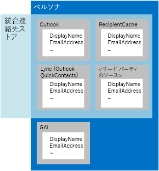

# Exchange 内の EWS のユーザーと連絡先

ペルソナと統合連絡先ストアについて説明し、Exchange で EWS マネージ API または EWS を使用した連絡先の操作方法について説明します。  
  
連絡先は、個人、グループ、または組織に関する情報を格納している Exchange 内のアイテムです。連絡先には、名前と電子メール アドレスに加えて、IM アドレス、住所、生年月日、家族情報、連絡先を示す写真やイメージを含むその他の情報を含めることができます。
  
連絡先情報は、2 つの場所のいずれかに格納されます。
  
- Active Directory ドメイン サービス (AD DS) 連絡先が組織内にある場合。
    
- 連絡先が組織外部の場合は、ユーザーのメールボックス内の連絡先フォルダーまたは別のフォルダー。
    
複数の連絡先アイテムには、1 人のユーザーを表すことができます。 Exchange では、これらの別の連絡先アイテムをまとめるためにペルソナを使用します。 *ペルソナ*とは、さまざまなソースから同じ個人の連絡先情報の集合体です。 さらに連絡先情報を Exchange で、ペルソナも集約できる QuickContacts と呼ばれる IM 連絡先の非表示のフォルダー、メールボックスの受信者のキャッシュ内の情報とサードパーティのデータ ソースから。 Exchange の統合連絡先ストアにより、この集計には; を使用する IM クライアント唯一の違いは、図 1 に示すように、統合連絡先ストアが AD DS から情報を集約していません。 
  
**図 1 です。ペルソナおよび統合連絡先ストアの連絡先情報のソース**

  
**表 1 です。EWS のマネージ API のメソッドとメンバーを操作するための EWS の操作**

|**目的…**|**この EWS 管理 API メソッドを使用します。**|**EWS 操作を使用します。**|
|:-----|:-----|:-----|
|新しい連絡先の作成    |新しい[連絡先](http://msdn.microsoft.com/en-us/library/office/microsoft.exchange.webservices.data.contact%28v=exchg.80%29.aspx)オブジェクトをインスタンス化し、 [Contact.Save](http://msdn.microsoft.com/en-us/library/office/microsoft.exchange.webservices.data.contact.save%28v=exchg.80%29.aspx)を使用して、   |[CreateItem](http://msdn.microsoft.com/library/417e994b-0a17-4c24-9527-04796b80b029%28Office.15%29.aspx)   |
|連絡先をコピーする    |[Contact.Copy](http://msdn.microsoft.com/en-us/library/office/microsoft.exchange.webservices.data.contact.copy%28v=exchg.80%29.aspx)   |[CopyItem](http://msdn.microsoft.com/library/bcc68f9e-d511-4c29-bba6-ed535524624a%28Office.15%29.aspx)   |
|連絡先を移動する    |[Contact.Move](http://msdn.microsoft.com/en-us/library/office/microsoft.exchange.webservices.data.contact.move%28v=exchg.80%29.aspx)   |[MoveItem](http://msdn.microsoft.com/library/dcf40fa7-7796-4a5c-bf5b-7a509a18d208%28Office.15%29.aspx)   |
|既存の連絡先を更新する    |[Contact.Bind](http://msdn.microsoft.com/en-us/library/office/microsoft.exchange.webservices.data.contact.bind%28v=exchg.80%29.aspx)と[Contact.Update](http://msdn.microsoft.com/en-us/library/office/microsoft.exchange.webservices.data.contact.update%28v=exchg.80%29.aspx)   |[UpdateItem](http://msdn.microsoft.com/library/298fdd71-a83d-4407-9728-4f0a8e2d857c%28Office.15%29.aspx)   |
|連絡先を削除する    |[Contact.Bind](http://msdn.microsoft.com/en-us/library/office/microsoft.exchange.webservices.data.contact.bind%28v=exchg.80%29.aspx)と[Contact.Delete](http://msdn.microsoft.com/en-us/library/office/microsoft.exchange.webservices.data.contact.delete%28v=exchg.80%29.aspx)   |[DeleteItem](http://msdn.microsoft.com/library/3e26c416-fa12-476e-bfd2-5c1f4bb7b348%28Office.15%29.aspx)   |
|連絡先を検索する    |[ExchangeService.FindItems](http://msdn.microsoft.com/en-us/library/office/microsoft.exchange.webservices.data.exchangeservice.finditems%28v=exchg.80%29.aspx)   |[FindItem](http://msdn.microsoft.com/library/ebad6aae-16e7-44de-ae63-a95b24539729%28Office.15%29.aspx)   |
|ユーザーを検索する    |該当なし    |[FindPeople](http://msdn.microsoft.com/library/446106b7-ff2d-4107-90c1-29f4d38ba128%28Office.15%29.aspx)   |
|配布グループを展開する    |[ExchangeService.ExpandGroup](http://msdn.microsoft.com/en-us/library/office/microsoft.exchange.webservices.data.exchangeservice.expandgroup%28v=exchg.80%29.aspx)   |[ExpandDL](http://msdn.microsoft.com/library/1f7837e7-9eff-4e10-9577-c40f7ed6af94%28Office.15%29.aspx)   |
|あいまいな名前を解決する    |[ExchangeService.ResolveName](http://msdn.microsoft.com/en-us/library/office/microsoft.exchange.webservices.data.exchangeservice.resolvename%28v=exchg.80%29.aspx)   |[ResolveNames](http://msdn.microsoft.com/library/6b4eb4b3-9ad6-4804-a09f-7e20cfea4dbb%28Office.15%29.aspx)   |
|ペルソナを取得する    |該当なし    |[GetPersona](http://msdn.microsoft.com/library/e2146df0-53d0-4caf-9758-b600bbc14b6a%28Office.15%29.aspx)   |
|連絡先の写真を使用する    |[Contact.SetContactPicture](http://msdn.microsoft.com/en-us/library/office/microsoft.exchange.webservices.data.contact.setcontactpicture%28v=exchg.80%29.aspx)、 [Contact.GetContactPictureAttachment](http://msdn.microsoft.com/en-us/library/office/microsoft.exchange.webservices.data.contact.getcontactpictureattachment%28v=exchg.80%29.aspx)、または[Contact.RemoveContactPicture](http://msdn.microsoft.com/en-us/library/office/microsoft.exchange.webservices.data.contact.setcontactpicture%28v=exchg.80%29.aspx)   |[GetUserPhoto](http://msdn.microsoft.com/library/f6e8143d-4235-428e-8f9c-ab6e9b1cfa6e%28Office.15%29.aspx)または[GetAttachment](http://msdn.microsoft.com/library/24d10a15-b942-415e-9024-a6375708f326%28Office.15%29.aspx)   |
   
## ペルソナ

最近まで、連絡先は通常、電子メール クライアントだけに格納されていました。今日では、電話、ソーシャル ネットワーク サイト、Exchange メールボックスの連絡先フォルダー、組織のディレクトリ サービスなど、さまざまな場所に格納することが一般的になってきました。連絡先情報の普及により、同一人物を表す複数の連絡先に、それぞれ異なる情報が含まれている場合があり、たとえば、1 つの連絡先には会社の電話番号、別の連絡先には個人の電話番号が含まれ、連絡先フォルダーに格納されている連絡先には、電話に格納されている同じ人物に関する連絡先とは別の名前が含まれている場合があります。
  
Exchange オンライン Office 365、および設置型のバージョンの Exchange が Exchange 2013 年以降の一部として Exchange Online で同一人物を表すさまざまなソースからの連絡先に割り当てられた 1 つのメッセージを電子メールで送信する方法に似ていますが会話に集約すると、一般的なを使用してリンク id。 集約された連絡先情報が Exchange サーバーによって返されると、各取引先担当者、ソース フォルダー、表示名、ID、ソース ID などの属性のセットが含まれています 返される属性をプロパティの合計が、ペルソナと呼ばれ、返されるプロパティのセットは、[ペルソナの図形](http://msdn.microsoft.com/library/61d87cd5-3270-40d1-bab7-d0d5bf938607%28Office.15%29.aspx)と呼ばれます。
  
ペルソナを構成する情報が 1 つの場所に格納されていないため、その情報をいつでも変更できますので、Exchange サーバーに要求を行う場合にのみ、ペルソナが作成されます。 ペルソナの検索要求を行うには、 [FindPeople](http://msdn.microsoft.com/library/446106b7-ff2d-4107-90c1-29f4d38ba128%28Office.15%29.aspx)の EWS のオペレーションを使用します。 要求では、並べ替え順序を含めることができ、オーダーして、結果をフィルター処理して適切なペルソナを検索するときにクエリ文字列に基づいてフィルター処理できます。 表示名と連絡先フォルダー、Hotmail のアカウント、LinkedIn アカウントでは、および企業のディレクトリ サービスから、特定の連絡先に関連付けられているすべての電子メール アドレスのセットを取得するなど、すべてのペルソナのセットを取得することができますがIM アドレスがあります。 連絡先へのリンクがペルソナに自動的にはさまざまなデバイスに格納されている連絡先との間の関係を認識するアルゴリズムに基づきます。 
  
> [!NOTE]
> EWS マネージ API はこの機能を実装していません。 
  
**表 2 になります。ペルソナを操作するための EWS の操作**

|**操作名**|**説明**|
|:-----|:-----|
|[FindPeople](http://msdn.microsoft.com/library/446106b7-ff2d-4107-90c1-29f4d38ba128%28Office.15%29.aspx)   |指定した連絡先フォルダーからすべての利用可能なペルソナを取得するか、指定したクエリ文字列に一致する連絡先を取得します。    |
|[GetPersona](http://msdn.microsoft.com/library/e2146df0-53d0-4caf-9758-b600bbc14b6a%28Office.15%29.aspx)   |指定したペルソナ ID のすべての IM アドレスや表示名など、指定したペルソナに関連付けられているプロパティのセットを返します。    |
   
**GetPersona**と**FindPeople**の操作を効率的に複数のソースから連絡先情報を取得するために使用できます。 ペルソナに関連するすべてのアイテムは、リンク ID に関連付けられた、ために、さまざまな連絡先データを使用するアプリケーションでこれらの操作を使用できます。 例を次に示します。 
  
- ユーザー、連絡先を呼び出すし、回答できない場合に、追加の電話番号を提供し、ときに、 **GetPersona**操作を使用する携帯電話アプリケーションです。 
    
- 既存のペルソナに出現するかどうかを判断するのには電子メール アドレスの受信トレイのメッセージをスキャンするのには、 **FindPeople**操作を使用するアプリケーションです。 そのペルソナによって表される人と、最近のすべての通信で潜在顧客またはリストが作成されていないユーザーに関連付けられているアドレスを使用できます。 
    
- 対応は、正式または非正式かどうかに基づいて別のあいさつ文を提供している[outlook のメール アプリケーション](mail-apps-for-outlook-and-ews-in-exchange.md)です。 正式なあいさつ文がディレクトリ サービスの表示名によって指定され、非公式のあいさつ文に由来するソーシャル ネットワークの連絡先に送信される表示名です。 
    
## 統合連絡先ストア

ペルソナは、電子メール クライアントだけのものではありません。IM クライアントを開発する場合、次の一部またはすべてを確認する必要があります。
  
- IM の連絡先アイテムの既定のセットを使用して Lync クライアント アプリケーションをプロビジョニングする方法は?
    
- IM 連絡先とグループの一覧はどのように管理しますか。
    
- カスタム Lync クライアントからの IM 連絡先と IM グループへのアクセスはどのように管理しますか。
    
統合連絡先ストアは Exchange の背後で動作し、Exchange やその他のソースから連絡先情報を単一のエンティティ、つまりペルソナに集約します。統合連絡先ストアへのアクセスに使用する EWS 操作は IM 連絡先に固有のものですが、Exchange の統合連絡先ストアは、あらゆる種類のアプリケーションのペルソナで使用できます。統合連絡先ストアでは、連絡先データ AD DS にアクセスできないことに注意してください。
  
IM の連絡先は、QuickContacts と呼ばれる隠しフォルダーに格納されます。 この隠しフォルダーに格納されているグループに連絡先を追加するのには、 **AddNewImContactToGroup**および**AddImContactToGroup**操作を使用できます。 IM の連絡先をグループ化する統合連絡先ストアを使用するためにアクセスして連絡先のグループをより簡単に更新します。 
  
> [!NOTE]
> EWS マネージ API はこの機能を実装していません。 
  
**表 3。統合連絡先ストアにアクセスするための EWS の操作**

|**操作名**|**説明**|
|:-----|:-----|
|[AddNewImContactToGroup](http://msdn.microsoft.com/library/0cb5525f-faa3-48f1-9551-df55ffc26f46%28Office.15%29.aspx)   |新しい IM 連絡先を、最大 1000 件まで IM グループに追加します。    |
|[AddImContactToGroup](http://msdn.microsoft.com/library/376acc42-2684-4596-aca1-82a4a10865c9%28Office.15%29.aspx)   |既存の IM 連絡先を、最大 1000 件まで IM グループに追加します。    |
|[AddImGroup](http://msdn.microsoft.com/library/6df6e504-b7c8-4773-b10f-ffa5defac229%28Office.15%29.aspx)   |新しい IM グループを、最大 64 個まで追加します。    |
|[AddDistributionGroupToImList](http://msdn.microsoft.com/library/5aa9bec8-71cf-4a6e-8ec8-b4965b40fd4a%28Office.15%29.aspx)   |新しい配布グループを、最大 64 個まで IM グループに追加します。    |
|[GetImItemList](http://msdn.microsoft.com/library/e31d14e1-0c1f-4b69-98b7-157d59c13698%28Office.15%29.aspx)   |IM グループと IM 連絡先のペルソナの一覧を取得します。    |
|[GetImItems](http://msdn.microsoft.com/library/51186691-46d2-4d5c-b8bc-4ee2bb20fbe7%28Office.15%29.aspx)   |特定の IM グループと IM 連絡先のペルソナの情報を取得します。    |
|[RemoveContactFromImList](http://msdn.microsoft.com/library/28ec96c3-45af-48ff-9f17-718a527dc0ad%28Office.15%29.aspx)   |IM グループから連絡先を削除します。    |
|[RemoveImContactFromGroup](http://msdn.microsoft.com/library/a190bbec-c71b-4e6a-880b-55854c724d8c%28Office.15%29.aspx)   |IM グループから IM 連絡先を削除します。    |
|[RemoveDistributionGroupFromImList](http://msdn.microsoft.com/library/252bddf2-98b6-4824-b548-2fba2bda5384%28Office.15%29.aspx)   |IM グループから配布グループを削除します。    |
|[RemoveImGroup](http://msdn.microsoft.com/library/5e788016-68e0-4a3f-9243-03f6b6c6b389%28Office.15%29.aspx)   |IM グループを削除します。    |
|[SetImGroup](http://msdn.microsoft.com/library/2d48aa07-8152-4c3d-a519-061253e80174%28Office.15%29.aspx)   |IM グループの表示名を変更します。    |
   
## このセクションの内容

- [Exchange EWS を使用してバッチ プロセスの連絡先](how-to-process-contacts-in-batches-by-using-ews-in-exchange.md)
    
- [Exchange 2013 の EWS を使用してあいまいな名前を解決するには](how-to-resolve-ambiguous-names-by-using-ews-in-exchange-2013.md)
    
- [EWS を使用して Exchange でのユーザーの写真を取り込み](how-to-get-user-photos-by-using-ews-in-exchange.md)
    
## 関連項目

- [Exchange の Web サービス クライアントを開発する](develop-web-service-clients-for-exchange.md)
    
- [Exchange で Web サービスの使用を開始する](start-using-web-services-in-exchange.md)
    
- [Exchange の EWS クライアントの設計の概要](ews-client-design-overview-for-exchange.md)
    

