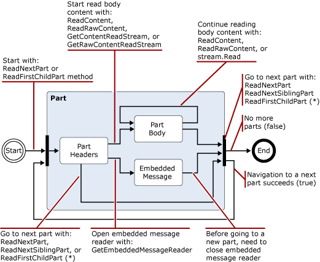

# Exchange 2013 トランスポート パイプライン内のメッセージの読み取りおよび変更

して、Exchange 2013 のトランスポート エージェントの読み取り、書き込み、およびメッセージを変更するのには.NET Framework クラスの詳細について説明します。
  
**に適用されます:** Exchange Server 2013
  
- メッセージの読み取り、書き込み、または変更に使用するクラス
- Encoders 名前空間
- iCalendar 名前空間
- MIME 名前空間
- TextConverters 名前空間
- Tnef 名前空間
- vCard 名前空間
  
メッセージがトランスポート パイプラインを通過するときに、トランスポート エージェントはメッセージの内容を読み取ったり、書き込んだり、別のデータ形式に変換したりできます。たとえば、MIME データを読み取ったり書き込んだりできます。また、uuencode 形式や Quoted-printable (qp) 形式の着信メッセージを識別して、そのメッセージを組織で使用している標準に変換することも、着信メッセージに関連付けられている予定表または連絡先情報を読み取って保存することもできます。  
  
さらに、セキュリティ上の問題を引き起こすコンテンツを識別し、それらを含むコンテンツやメッセージを移動または削除する (たとえば、HTML メッセージのリンクを削除するなど) こともできます。
  
この記事では、メッセージの読み取り、書き込み、および変更に使用できる .NET Framework のクラスに関する情報を提供します。
  
> [!CAUTION]
> コンテンツ変換 API の多くのプロパティとパラメーターには、パフォーマンスの問題 (サービス拒否攻撃を含む) を引き起こすほど大きな値が使用できます。トランスポート エージェントでコンテンツ変換 API を使用する場合は、エージェントのリソース消費量に制限をかけるため、読み取り時や書き込み時にプロパティ値とパラメーター値でサポートするサイズに制限を実装する必要があります。 

## メッセージの読み取り、書き込み、または変更に使用するクラス

次の表に、電子メール メッセージの読み取り、書き込み、および変更に使用できる .NET Framework のクラスを示します。
  
**.NET Framework のメッセージ処理の名前空間**

|**.NET Framework 名前空間**|**Classes**|
|:-----|:-----|
|[Microsoft.Exchange.Data.Mime.Encoders](https://msdn.microsoft.com/library/Microsoft.Exchange.Data.Mime.Encoders.aspx)   |メモリ内のエンコードおよびデコードするためのクラス、エンコーダーのストリーム クラス、関連する列挙体に含まれているエンコーダーまたはデコーダーのクラスのいずれかを受け入れると、 [ByteEncoder](https://msdn.microsoft.com/library/Microsoft.Exchange.Data.Mime.Encoders.ByteEncoder.aspx)基本クラス、 [ByteEncoderException](https://msdn.microsoft.com/library/Microsoft.Exchange.Data.Mime.Encoders.ByteEncoderException.aspx)例外クラスが含まれていますエンコーダーおよびデコーダー。    |
|[Microsoft.Exchange.Data.ContentTypes.iCalendar](https://msdn.microsoft.com/library/Microsoft.Exchange.Data.ContentTypes.iCalendar.aspx)   |予定表の情報が含まれているデータ ストリームの読み書きを可能にする型が含まれています。これには、予定表のリーダーとライター、例外オブジェクト、定期的なアイテム オブジェクト、および予定表アイテムに関するプロパティ情報を返す際に役立つ構造体と列挙体が含まれます。    |
|[Microsoft.Exchange.Data.Mime](https://msdn.microsoft.com/library/Microsoft.Exchange.Data.Mime.aspx)   |MIME データの作成、読み取り、書き込み、走査、エンコード、およびデコードに使用できるクラス、構造体、列挙体およびデリゲートが含まれています。これには、MIME データ ストリームへの順方向専用の読み取り書き込みアクセスが可能になるストリーム ベースのリーダーとライターと、MIME ドキュメントに使用可能な DOM ベースのメソッドとクラスが含まれています。    |
|[Microsoft.Exchange.Data.TextConverters](https://msdn.microsoft.com/library/Microsoft.Exchange.Data.TextConverters.aspx)   |データ ストリームの読み書きと、特定のデータ形式間での変換 (HTML からリッチ テキスト形式 (RTF) への変換など) の実行を可能にするクラス、構造体、列挙体、およびデリゲートが含まれています。テキスト コンバーターを使用すると、ドキュメント ストリームの形式を相互に変換できるようになり、セキュリティ上のリスクを招く可能性のあるドキュメントの要素を選択的に削除することもできるようになります。     |
|[Microsoft.Exchange.Data.ContentTypes.Tnef](https://msdn.microsoft.com/library/Microsoft.Exchange.Data.ContentTypes.Tnef.aspx)   |Transport Neutral Encapsulation Format (TNEF) の読み取りと書き込みが容易になる順方向専用のストリーム リーダーとライター、例外クラス、および構造体と列挙体が含まれています。    |
|[Microsoft.Exchange.Data.ContentTypes.vCard](https://msdn.microsoft.com/library/Microsoft.Exchange.Data.ContentTypes.vCard.aspx)   |vCard 形式の連絡先データの読み取りと書き込みが容易になる順方向専用のストリーム リーダーとライター、例外クラス、および構造体と列挙体が含まれています。    |
   
## Encoders 名前空間

エンコーダーの名前空間には、メモリ内のエンコードとデコード用のクラスが含まれています。 これらは、 [ByteEncoder](https://msdn.microsoft.com/library/Microsoft.Exchange.Data.Mime.Encoders.ByteEncoder.aspx)の基本クラスから継承します。 クラスは、エンコードし、base64、BinHex でデコード quoted-printable (qp)、および Unix の (Uu)。 次のクラスは、メモリ内のエンコードとデコードに使用されます。 
  
- [Base64Encoder](https://msdn.microsoft.com/library/Microsoft.Exchange.Data.Mime.Encoders.Base64Encoder.aspx)
    
- [Base64Decoder](https://msdn.microsoft.com/library/Microsoft.Exchange.Data.Mime.Encoders.Base64Decoder.aspx)
    
- [BinHexEncoder](https://msdn.microsoft.com/library/Microsoft.Exchange.Data.Mime.Encoders.BinHexEncoder.aspx)
    
- [BinHexDecoder](https://msdn.microsoft.com/library/Microsoft.Exchange.Data.Mime.Encoders.BinHexDecoder.aspx)
    
- [QPEncoder](https://msdn.microsoft.com/library/Microsoft.Exchange.Data.Mime.Encoders.QPEncoder.aspx)
    
- [QPDecoder](https://msdn.microsoft.com/library/Microsoft.Exchange.Data.Mime.Encoders.QPDecoder.aspx)
    
- [UUEncoder](https://msdn.microsoft.com/library/Microsoft.Exchange.Data.Mime.Encoders.UUEncoder.aspx)
    
- [UUDecoder](https://msdn.microsoft.com/library/Microsoft.Exchange.Data.Mime.Encoders.UUDecoder.aspx)
    
エンコーダーおよびデコーダー [ByteEncoder](https://msdn.microsoft.com/library/Microsoft.Exchange.Data.Mime.Encoders.ByteEncoder.aspx)基本クラスから継承し、 [ByteEncoderException](https://msdn.microsoft.com/library/Microsoft.Exchange.Data.Mime.Encoders.ByteEncoderException.aspx)の例外クラスを使用して、エラー処理をします。 
  
さらに、名前空間には、エンコードされた MacBinary ファイルを識別し、その関連付けられているファイルのヘッダーを読み取り、 [MacBinaryHeader](https://msdn.microsoft.com/library/Microsoft.Exchange.Data.Mime.Encoders.MacBinaryHeader.aspx)クラスが含まれています。 
  
最後に、 [EncoderStream](https://msdn.microsoft.com/library/Microsoft.Exchange.Data.Mime.Encoders.EncoderStream.aspx)クラスは、メモリ内のオブジェクトではなくデータ ストリームの変換を実行します。 このクラスでは、エンコーダーまたはデコーダーのクラスの 1 つ、およびいずれかの読み取りを受け入れるか、関連付けられている[EncoderStreamAccess](https://msdn.microsoft.com/library/Microsoft.Exchange.Data.Mime.Encoders.EncoderStreamAccess.aspx)列挙体によって書き込みます。 
  
## iCalendar 名前空間

iCalendar 名前空間には、iCalendar データに対応した順方向専用のリーダーおよびライターと、iCalendar ストリームの作成、アクセス、および変更をサポートする構造体とクラスが用意されています。
  
[CalendarReader](https://msdn.microsoft.com/library/Microsoft.Exchange.Data.ContentTypes.iCalendar.CalendarReader.aspx) 、 [CalendarWriter](https://msdn.microsoft.com/library/Microsoft.Exchange.Data.ContentTypes.iCalendar.CalendarWriter.aspx)クラスを使用する iCalendar のデータのストリームを読み書きします。 
  
CalendarReader は、読み取り可能な[ストリーム](https://msdn.microsoft.com/library/System.IO.Stream.aspx)をそのコンス トラクターに引数として使用します。 [ReadFirstChildComponent](https://msdn.microsoft.com/library/Microsoft.Exchange.Data.ContentTypes.iCalendar.CalendarReader.ReadFirstChildComponent.aspx) 、 [ReadNextSiblingComponent](https://msdn.microsoft.com/library/Microsoft.Exchange.Data.ContentTypes.iCalendar.CalendarReader.ReadNextSiblingComponent.aspx) 、および[ReadNextComponent](https://msdn.microsoft.com/library/Microsoft.Exchange.Data.ContentTypes.iCalendar.CalendarReader.ReadNextComponent.aspx)メソッドは、順番にコンポーネントにアクセスする、iCalendar のデータ ストリームで使用できます。 [ComplianceMode](https://msdn.microsoft.com/library/Microsoft.Exchange.Data.ContentTypes.iCalendar.CalendarReader.ComplianceMode.aspx)プロパティに設定した値に基づき、iCalendar のストリーム内のエラーは、スローされる例外が発生または[準拠](https://msdn.microsoft.com/library/Microsoft.Exchange.Data.ContentTypes.iCalendar.CalendarComplianceStatus.Compliant.aspx)以外の値に設定する[ComplianceStatus](https://msdn.microsoft.com/library/Microsoft.Exchange.Data.ContentTypes.iCalendar.CalendarReader.ComplianceStatus.aspx)プロパティは。 ICalendar のデータを受信して、問題を検出するには、このプロパティをチェックすることができます。 
  
[CalendarWriter](https://msdn.microsoft.com/library/Microsoft.Exchange.Data.ContentTypes.iCalendar.CalendarWriter.aspx)クラスは、書き込み可能な[ストリーム](https://msdn.microsoft.com/library/System.IO.Stream.aspx)をそのコンス トラクターに引数として使用します。 
  
## MIME 名前空間

MIME 名前空間には、MIME ドキュメントの作成、アクセス、および変更を可能にするクラスが用意されています。ストリーム ベースのメソッドまたは DOM ベースのメソッドのどちらかを使用して、MIME ドキュメントを操作できます。
  
### MimeDocument クラスと MIME DOM

[MimeDocument](https://msdn.microsoft.com/library/Microsoft.Exchange.Data.Mime.MimeDocument.aspx)クラスは、MIME ドキュメントへのアクセスの DOM を使用できます。 全体の DOM との読み込みに使用可能なメモリがある場合は、この型のオブジェクトを使用して、ヘッダーとメッセージの内容へのランダム アクセスが必要です。 
  
[MimeDocument](https://msdn.microsoft.com/library/Microsoft.Exchange.Data.Mime.MimeDocument.aspx)オブジェクトにデータをロードするには、 [GetLoadStream](https://msdn.microsoft.com/library/Microsoft.Exchange.Data.Mime.MimeDocument.GetLoadStream.aspx)または[読み込み](https://msdn.microsoft.com/library/Microsoft.Exchange.Data.Mime.MimeDocument.Load.aspx)メソッドを使用します。 ことができますし、DOM 階層をウォークし作成、変更、または MIME データを削除します。 MIME データを変更した後は、[書き込ま](https://msdn.microsoft.com/library/Microsoft.Exchange.Data.Mime.MimeNode.WriteTo.aspx)メソッドのいずれかを使用してストリームに記述することができます。 
  
次の図は、 [MimeDocument](https://msdn.microsoft.com/library/Microsoft.Exchange.Data.Mime.MimeDocument.aspx)オブジェクト内のデータの構造を示しています。 
  
**図 1 です。MimeDocument オブジェクトの構造**

  
### MimeReader クラスおよび MimeWriter クラスとストリーム ベースの MIME 解析

[MimeReader](https://msdn.microsoft.com/library/Microsoft.Exchange.Data.Mime.MimeReader.aspx)および[MimeWriter](https://msdn.microsoft.com/library/Microsoft.Exchange.Data.Mime.MimeWriter.aspx)のクラスは、MIME ストリームを順方向専用のアクセスを有効にします。 既に読み取りまたは書き込まれたデータが必要な MIME データを変更する必要はない場合は、これらのクラスを使用します。 たとえば、定義済みの形式に一致するメッセージを印刷するには、 [MimeWriter](https://msdn.microsoft.com/library/Microsoft.Exchange.Data.Mime.MimeWriter.aspx)クラスが理想的な可能性があります。 
  
[MimeDocument](https://msdn.microsoft.com/library/Microsoft.Exchange.Data.Mime.MimeDocument.aspx)クラスは、DOM. をカプセル化します。 [MimeReader](https://msdn.microsoft.com/library/Microsoft.Exchange.Data.Mime.MimeReader.aspx)および[MimeWriter](https://msdn.microsoft.com/library/Microsoft.Exchange.Data.Mime.MimeWriter.aspx)のクラスでは、コンピューターの状態を表します。 入力を受信し、呼び出されるメソッドに基づく、状態変更します。 図 2 ~ 5 は、メソッドは各状態となる状態から呼び出すには有効では、 [MimeReader](https://msdn.microsoft.com/library/Microsoft.Exchange.Data.Mime.MimeReader.aspx)オブジェクトを示す、簡略化された状態遷移図です。 
  
これらのダイアグラムを使用するには、次のメソッドの呼び出しを示す、次に 1 つの状態から、矢印または状態を変更する値を返します。 たとえば、最初の図では、作成した MimeReader に所属しているストリームの先頭にするいると仮定します。 一部のヘッダーの状態を取得するには、順序になるように[ReadNextPart](https://msdn.microsoft.com/library/Microsoft.Exchange.Data.Mime.MimeReader.ReadNextPart.aspx)または[ReadFirstChildPart](https://msdn.microsoft.com/library/Microsoft.Exchange.Data.Mime.MimeReader.ReadFirstChildPart.aspx)のいずれかを呼び出します。 場合 (整形式では、MIME) の場合は、ヘッダーがある、一部のヘッダーの状態を入力します。 それ以外の場合、例外がスローされます。 
  
**図 2 になります。MimeReader オブジェクトの簡単な状態遷移の図**

  
> [!NOTE]
> 図 3、4 および 5 では、それぞれ前の図に示した状態を詳しく説明しています。 
  
**図 3 です。図 2 から一部のヘッダーの状態の拡張**

  
**図 4 です。ヘッダー内のパラメーターが発生した場合、図 3 からヘッダーの状態の拡張**

  
> [!NOTE]
> 図 5 で表される状態は再帰的なグループ内のアドレスを参照するのには[GroupRecipientReader](https://msdn.microsoft.com/library/Microsoft.Exchange.Data.Mime.MimeAddressReader.GroupRecipientReader.aspx)プロパティを使用するには、アドレス グループが検出された場合。 
  
**図 5。アドレスまたはアドレス グループが検出されると、図 3 からヘッダーの状態の拡張**

  
図 6 および 7 は、 [MimeWriter](https://msdn.microsoft.com/library/Microsoft.Exchange.Data.Mime.MimeWriter.aspx)オブジェクトの簡単な状態遷移の図を表示します。 
  
> [!NOTE]
> 図 7 では、図 6 に示した Part Headers 状態を詳しく説明しています。 
  
**図 6 です。MimeWriter オブジェクトの簡単な状態遷移の図**

  
**図 7 です。図 6 から一部のヘッダーの状態の拡張**

  
## TextConverters 名前空間

TextConverters 名前空間には、電子メール メッセージのコンテンツの変換をサポートする型が含まれています。 これらの種類はコード ページ変換を実行、安全ではありませんが、HTML を削除および電子メール メッセージの本文でその他の変換を実行します。 [Microsoft.Exchange.Data.TextConverters](https://msdn.microsoft.com/library/Microsoft.Exchange.Data.TextConverters.aspx)名前空間には、次の[TextConverter](https://msdn.microsoft.com/library/Microsoft.Exchange.Data.TextConverters.TextConverter.aspx)抽象クラスから派生したクラスが含まれています。 
  
- [EnrichedToHtml](https://msdn.microsoft.com/library/Microsoft.Exchange.Data.TextConverters.EnrichedToHtml.aspx)
    
- [EnrichedToText](https://msdn.microsoft.com/library/Microsoft.Exchange.Data.TextConverters.EnrichedToText.aspx)
    
- [HtmlToEnriched](https://msdn.microsoft.com/library/Microsoft.Exchange.Data.TextConverters.HtmlToEnriched.aspx)
    
- [HtmlToHtml](https://msdn.microsoft.com/library/Microsoft.Exchange.Data.TextConverters.HtmlToHtml.aspx)
    
- [HtmlToRtf](https://msdn.microsoft.com/library/Microsoft.Exchange.Data.TextConverters.HtmlToRtf.aspx)
    
- [HtmlToText](https://msdn.microsoft.com/library/Microsoft.Exchange.Data.TextConverters.HtmlToText.aspx)
    
- [RtfCompressedToRtf](https://msdn.microsoft.com/library/Microsoft.Exchange.Data.TextConverters.RtfCompressedToRtf.aspx)
    
- [RtfToHtml](https://msdn.microsoft.com/library/Microsoft.Exchange.Data.TextConverters.RtfToHtml.aspx)
    
- [RtfToRtf](https://msdn.microsoft.com/library/Microsoft.Exchange.Data.TextConverters.RtfToRtf.aspx)
    
- [RtfToRtfCompressed](https://msdn.microsoft.com/library/Microsoft.Exchange.Data.TextConverters.RtfToRtfCompressed.aspx)
    
- [RtfToText](https://msdn.microsoft.com/library/Microsoft.Exchange.Data.TextConverters.RtfToText.aspx)
    
- [TextToHtml](https://msdn.microsoft.com/library/Microsoft.Exchange.Data.TextConverters.TextToHtml.aspx)
    
- [TextToRtf](https://msdn.microsoft.com/library/Microsoft.Exchange.Data.TextConverters.TextToRtf.aspx)
    
- [TextToText](https://msdn.microsoft.com/library/Microsoft.Exchange.Data.TextConverters.TextToText.aspx)
    
これらのテキスト コンバーターを使用すると、ドキュメント ストリームの形式を変更する、または HTML ドキュメントから保護されていない要素を削除することができます。 [TextConverter](https://msdn.microsoft.com/library/Microsoft.Exchange.Data.TextConverters.TextConverter.aspx)基本クラスの変換メソッドのいずれかに 1 回の呼び出しを使用して変換を実行するのには単独でこれらのクラスを使用できますか、コンバーターで変換後の読み取りを実行するのにはそれを使用または書き込みのコンス トラクターに引き渡すことができます。 
  
基本クラスから継承した機能では、元の文書と、変換後の出力を格納するための十分な空き領域がある場合、または変換の結果を格納する場合は、変換を実行するのに便利です。 **Convert**メソッドでは、入力と出力ストリーム、テキスト リーダー、または、テキスト ライターには、関連付けられている出力への入力の内容を変換します。 
  
この名前空間には、次に示すテキスト リーダー、ライター、およびストリームのクラスも含まれています。
  
- [ConverterReader](https://msdn.microsoft.com/library/Microsoft.Exchange.Data.TextConverters.ConverterReader.aspx) - **System.IO.TextReader**から派生します。 
    
- [ConverterWriter](https://msdn.microsoft.com/library/Microsoft.Exchange.Data.TextConverters.ConverterWriter.aspx) - **System.IO.TextWriter**から派生します。 
    
- [ConverterStream](https://msdn.microsoft.com/library/Microsoft.Exchange.Data.TextConverters.ConverterStream.aspx) - **System.IO.Stream**から派生します。 
    
これらは、元のデータや変換後の出力を保存する領域がない場合、ストリームからの入力を受信する場合やストリームに出力を送信する場合、または出力の用途がインデックスの作成や検索のみで変換の結果を保存する必要のない場合の変換を実行するために使用します。
  
## Tnef 名前空間

Tnef 名前空間には、TNEF データについて順方向専用のストリーム ベースの読み取りおよび書き込みを可能にするクラスと型が含まれています。TNEF とは、MAPI を解釈できないクライアントのために、MAPI のプロパティをカプセル化することを目的として使用されるデータ形式のことです。
  
[TnefReader](https://msdn.microsoft.com/library/Microsoft.Exchange.Data.ContentTypes.Tnef.TnefReader.aspx)および[TnefWriter](https://msdn.microsoft.com/library/Microsoft.Exchange.Data.ContentTypes.Tnef.TnefWriter.aspx)のクラスは、 [Microsoft.Exchange.Data.ContentTypes.Tnef](https://msdn.microsoft.com/library/Microsoft.Exchange.Data.ContentTypes.Tnef.aspx)名前空間内のコア機能を提供します。 
  
[TnefReader](https://msdn.microsoft.com/library/Microsoft.Exchange.Data.ContentTypes.Tnef.TnefReader.aspx)クラスは、読み取り可能なストリームをそのコンス トラクターに引数として使用します。 [ReadNextAttribute](https://msdn.microsoft.com/library/Microsoft.Exchange.Data.ContentTypes.Tnef.TnefReader.ReadNextAttribute.aspx)メソッドを使用するには、連続的に TNEF ストリーム内の属性を読み取る。 属性を参照した後は、 [TnefReader](https://msdn.microsoft.com/library/Microsoft.Exchange.Data.ContentTypes.Tnef.TnefReader.aspx)オブジェクトの現在のプロパティを読み取るための[TnefPropertyReader](https://msdn.microsoft.com/library/Microsoft.Exchange.Data.ContentTypes.Tnef.TnefPropertyReader.aspx)を取得するだけでなく、上のすべての読み取り専用プロパティを使用して、属性に関する情報を表示できます。 現在の属性は、 [ReadAttributeRawValue](https://msdn.microsoft.com/library/Microsoft.Exchange.Data.ContentTypes.Tnef.TnefReader.ReadAttributeRawValue.aspx)メソッドを使用しても直接アクセスできます。 
  
[TnefWriter](https://msdn.microsoft.com/library/Microsoft.Exchange.Data.ContentTypes.Tnef.TnefWriter.aspx)クラスは、書き込み可能な[ストリーム](https://msdn.microsoft.com/library/System.IO.Stream.aspx)をそのコンス トラクターに引数として使用します。 [TnefWriter](https://msdn.microsoft.com/library/Microsoft.Exchange.Data.ContentTypes.Tnef.TnefWriter.aspx)クラスには、このストリームにデータを記述するための複数の方法が用意されています。 
  
## vCard 名前空間

vCard 名前空間には、vCard データ形式で電子メール メッセージに含まれている連絡先情報を読み書きするために使用するクラス、構造体、および列挙体が含まれています。この名前空間には、電子メール メッセージに関連付けられた vCard データの読み取りを可能にする連絡先リーダーとライター、例外クラス、プロパティ リーダー、パラメーター リーダー、およびサポート用列挙体が含まれています。
  
## 関連項目

- [Exchange のトランスポート エージェント](transport-agents-in-exchange-2013.md)  
- [トランスポート エージェントの概念には、Exchange 2013](transport-agent-concepts-in-exchange-2013.md) 
- [Exchange 2013 のトランスポート エージェントのリファレンス](transport-agent-reference-for-exchange-2013.md)
- [MIME メディア タイプ](http://www.iana.org/assignments/media-types)
    

