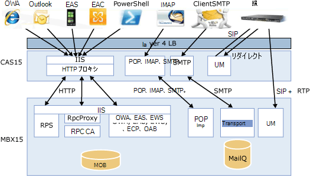

# Exchange 2013 におけるトランスポート エージェントの概念

Exchange 2013 のトランスポートエージェントパイプラインおよびサーバーの役割のアーキテクチャがトランスポートエージェントの開発に及ぼす影響、およびトランスポートエージェントの開発に使用できるクラスについて説明します。 
  
**製品:** Exchange Server 2013 
  
Exchange Server 2013 で提供されるクラスライブラリを使用して、イベントを登録し、トランスポートパイプラインを通過するメッセージに対してアクションを実行するトランスポートエージェントを実装できます。 また、メッセージの変更とコンテンツの変換にも、トランスポート エージェントを使用できます。 
  
この記事では、トランスポートエージェントとトランスポートパイプラインのアーキテクチャについて説明します。 トランスポート動作を変更して組織のニーズを満たすことができるように、トランスポートパイプラインのアーキテクチャを理解しておくことが重要です。 この記事では、トランスポートエージェントとトランスポートエージェントの開発に使用できるクラスに影響する Exchange 2013 アーキテクチャの変更についても説明します。 
  
## トランスポート パイプライン内のトランスポート エージェント

トランスポート エージェントは、次に示す 3 つのクラスのいずれかから派生します。
  
- [SmtpReceiveAgent](https://msdn.microsoft.com/library/Microsoft.Exchange.Data.Transport.Smtp.SmtpReceiveAgent.aspx)
- [RoutingAgent](https://msdn.microsoft.com/library/Microsoft.Exchange.Data.Transport.Routing.RoutingAgent.aspx)
- [DeliveryAgent](https://msdn.microsoft.com/library/Microsoft.Exchange.Data.Transport.Delivery.DeliveryAgent.aspx)
    
トランスポート パイプラインとは、Exchange 2013 組織の境界内でのメッセージ データの流れのことを意味します。パイプラインは、次の表に示したサービスによって成立します。
  
**表1トランスポートパイプラインサービス**

|**サービス**|**説明**|**サポートされるクラス**|
|:-----|:-----|:-----|
|フロント エンド トランスポート    |すべての[クライアントアクセスサーバー](https://technet.microsoft.com/library/dd298114%28v=exchg.150%29.aspx)上で実行され、Exchange 2013 組織のすべての受信および送信外部 SMTP トラフィックのステートレスプロキシとして機能します。 フロント エンド トランスポート サービスは、メッセージ コンテンツを検査することも、メッセージをローカルにキューに格納することもありません。 [メールボックスサーバー](https://technet.microsoft.com/library/jj150491%28v=exchg.150%29.aspx)上のトランスポートサービスと通信します。    |[SmtpReceiveAgent](https://msdn.microsoft.com/library/Microsoft.Exchange.Data.Transport.Smtp.SmtpReceiveAgent.aspx)   |
|Transport    |すべてのメールボックスサーバー上で実行され、Exchange Server 2010 の[ハブトランスポートサーバー](https://technet.microsoft.com/library/bb123494%28v=exchg.141%29.aspx)の役割に似ています。 トランスポートサービスは、メールボックストランスポートサービスとフロントエンドトランスポートサービスの間でメッセージをルーティングします。 このサービスは、メールボックスデータベースと直接通信しません。    |[SmtpReceiveAgent](https://msdn.microsoft.com/library/Microsoft.Exchange.Data.Transport.Smtp.SmtpReceiveAgent.aspx)   [RoutingAgent](https://msdn.microsoft.com/library/Microsoft.Exchange.Data.Transport.Routing.RoutingAgent.aspx)   [DeliveryAgent](https://msdn.microsoft.com/library/Microsoft.Exchange.Data.Transport.Delivery.DeliveryAgent.aspx)   |
|メールボックス トランスポート    |すべてのメールボックスサーバー上で実行され、メールボックストランスポート発信とメールボックストランスポート配信という2つの個別のサービスで構成されます。 メールボックストランスポート配信は、トランスポートサービスから SMTP メッセージを受信し、Exchange リモートプロシージャコール (RPC) を使用してメッセージを配信することによって、メールボックスデータベースに接続します。 メールボックストランスポート発信は、メッセージを取得するために RPC を使用してメールボックスデータベースに接続し、SMTP を介してトランスポートサービスにメッセージを送信します。    |なし。    |
   
### トランスポート イベント

トランスポート エージェントは、まずイベントを登録して、そのイベントが発生したときにアクションを起こすことで実装します。3 種類のそれぞれのエージェントで、異なるイベントのセットを登録できます。
  
次の図は、トランスポート エージェントがトランスポート パイプラインのどの部分でイベントを登録できるかを示しています。
  
**図1。トランスポートイベント**

  
メッセージがトランスポートパイプラインに入ると、 [Smtpreceiveagent](https://msdn.microsoft.com/library/Microsoft.Exchange.Data.Transport.Smtp.SmtpReceiveAgent.aspx)クラスから派生したトランスポートエージェントは、エージェントが登録した SMTP イベントの中でメッセージを処理することができます。 [Routingagent](https://msdn.microsoft.com/library/Microsoft.Exchange.Data.Transport.Routing.RoutingAgent.aspx)クラスから派生したエージェントは、に登録されている4つのカテゴライザーイベントのいずれかに対して動作できます。 [Deliveryagent](https://msdn.microsoft.com/library/Microsoft.Exchange.Data.Transport.Delivery.DeliveryAgent.aspx)クラスから派生したエージェントは、に登録されている配信イベントのいずれかでメッセージを処理できます。 
  
## トランスポート エージェントとサーバーの役割

Exchange 2013 のサーバーの役割のアーキテクチャに対する変更は、トランスポートエージェントとトランスポートエージェントが実行できることに影響します。 Exchange 2013 には、次のサーバーの役割が含まれています。
  
- メールボックス サーバー: クライアント アクセス プロトコル、トランスポート サービス、メールボックス データベース、ユニファイド メッセージング コンポーネントが含まれます。 メールボックス サーバーは、Active Directory ドメイン サービス (AD DS)、クライアント アクセス サーバー、および Outlook などのメール クライアントと直接通信します。
    
- クライアント アクセス サーバー: 認証、制限付きリダイレクト、プロキシ サービス、およびクライアント アクセス プロトコル (HTTP、POP、IMAP、SMTP など) を提供します。
    
- エッジ トランスポート サーバー: 電子メールを組織の内外にルーティングします。エッジ トランスポート サーバーは、通常、Exchange トポロジの境界に配置されます。
    
この統合構造を使用すると、Exchange 2013 環境に展開する必要があるサーバーの数を減らすことができます。 管理者は、メールボックスサーバーを含むすべての Active Directory サイトにハブトランスポートサーバーとクライアントアクセスサーバーを展開する必要がなくなり、新しい機能を利用するためにすべてのサーバーの役割を更新する必要がなくなりました。
  
このようなサーバーの役割アーキテクチャに対する変更は、カスタムのエージェントがパイプラインのどの部分でイベントに応答できるかに影響を及ぼす可能性があります。 Exchange 2013 よりも前の Exchange の各バージョンに対応したトランスポート エージェントを作成してある場合は、アーキテクチャの変更点を確認して、カスタムのエージェントに変更を加える必要があるかどうかを判断してください。
  
次の図は、Exchange 2013 のアーキテクチャ上の変更点が、どのようにトランスポート パイプラインを合理化および統合化しているかについて示しています。この図では、クライアント アクセス サーバーに「CAS」というラベルが付けられています。また、メールボックス サーバーには「MBX」というラベルが付けられています。
  
**図2Exchange 2013 のサーバーの役割のアーキテクチャ**

  
次の図は、Exchange 2013 のサーバーの役割間での相互作用を示しています。
  
**図3メールボックスおよびクライアントアクセスサーバーの相互作用**

  
Exchange 2013 サーバーの役割アーキテクチャの変更の詳細については、「exchange [2013 の新機能](https://technet.microsoft.com/library/jj150540%28v=exchg.150%29.aspx)」の「 [exchange 2013 アーキテクチャ](https://technet.microsoft.com/library/jj150540%28v=exchg.150%29.aspx#BKMK_Arch)」を参照してください。 
  
## トランスポート エージェントのクラス

カスタムのトランスポート エージェントの派生元クラスにより、そのエージェントで登録できるイベントが決まります。通常、カスタムのエージェントには、1 つのエージェント クラス、1 つのエージェント ファクトリ、1 つ以上のイベント ハンドラー、およびエージェントで処理するアクションを実行するコードが含まれています。
  
次の表は、それぞれのエージェントの種類の派生元になるクラスを示しています。
  
**表2エージェントクラス**

||||
|:-----|:-----|:-----|
|エージェントの種類    |ファクトリの基底クラス    |エージェントの基底クラス    |
|SMTP の受信    |[SmtpReceiveAgentFactory](https://msdn.microsoft.com/library/Microsoft.Exchange.Data.Transport.Smtp.SmtpReceiveAgentFactory.aspx)   |[SmtpReceiveAgent](https://msdn.microsoft.com/library/Microsoft.Exchange.Data.Transport.Smtp.SmtpReceiveAgent.aspx)   |
|承認    |[RoutingAgentFactory](https://msdn.microsoft.com/library/Microsoft.Exchange.Data.Transport.Routing.RoutingAgentFactory.aspx)   |[RoutingAgent](https://msdn.microsoft.com/library/Microsoft.Exchange.Data.Transport.Routing.RoutingAgent.aspx)   |
|Delivery    |[DeliveryAgentFactory\<Manager\>](https://msdn.microsoft.com/library/dd877550(v=exchg.150).aspx)   |[DeliveryAgent](https://msdn.microsoft.com/library/microsoft.exchange.data.transport.delivery.deliveryagent(v=exchg.150).aspx)   |
   
これらのファクトリとエージェントの基底クラスには、トランスポート イベントとメッセージへのアクセスに使用できるプロパティとメソッドが用意されています。カスタムのエージェントには、これらのクラスから継承するクラスを実装します。エージェント ファクトリ派生クラスでは、**CreateAgent** メソッドをオーバーライドして、カスタムのエージェント クラスの新しいインスタンスを返すようにします。 
  
イベントに渡される引数には、[電子メールメッセージ](https://msdn.microsoft.com/library/Microsoft.Exchange.Data.Transport.Email.EmailMessage.aspx)クラスのインスタンスを含めることができます。これは、基になるメッセージのプロパティとコンテンツを変更するために使用できます。 すべてのメッセージ情報が、各イベントで使用できるわけではありません。 実行するタスクにとって最適なエージェントとイベントを判断する必要があります。 
  
次に示す名前空間には、トランスポート パイプライン内のメッセージを読み取り、書き込み、および変更するために使用できる型が含まれています。
  
- [(データの場合)](https://msdn.microsoft.com/library/Microsoft.Exchange.Data.Mime.Encoders.aspx)
    
- [ContentTypes を行います。](https://msdn.microsoft.com/library/Microsoft.Exchange.Data.ContentTypes.iCalendar.aspx)
    
- [Microsoft. データの Mime](https://msdn.microsoft.com/library/Microsoft.Exchange.Data.Mime.aspx)
    
- [ContentTypes (. Tnef)](https://msdn.microsoft.com/library/Microsoft.Exchange.Data.ContentTypes.Tnef.aspx)
    
- [ContentTypes (. vCard)](https://msdn.microsoft.com/library/Microsoft.Exchange.Data.ContentTypes.vCard.aspx)
    
トランスポートエージェントを作成したら、Exchange 管理シェルを使用して[エージェントをインストールおよび管理](https://technet.microsoft.com/library/bb125175%28v=exchg.150%29.aspx)します。 詳細については、「[Exchange 2013 のトランスポート エージェントの作成](creating-transport-agents-for-exchange-2013.md)」を参照してください。 
  
## 関連項目

- [Exchange のトランスポート エージェント](transport-agents-in-exchange-2013.md)    
- [Exchange 2013 のトランスポート エージェントのリファレンス](transport-agent-reference-for-exchange-2013.md)   
- [Exchange 2013 トランスポート パイプライン内のメッセージの読み取りおよび変更](reading-and-modifying-messages-in-the-exchange-2013-transport-pipeline.md)    
- [Exchange 2013 の新機能](https://technet.microsoft.com/library/jj150540%28v=exchg.150%29.aspx)   
- [Exchange 2013 のサーバーの役割のアーキテクチャ](https://blogs.technet.com/b/exchange/archive/2013/01/23/exchange-2013-server-role-architecture.aspx)    
- [メールボックスサーバーとクライアントアクセスサーバー](https://technet.microsoft.com/library/jj150519%28v=exchg.150%29.aspx)   
- [Exchange Server 2013 メールフロー](https://technet.microsoft.com/library/aa996349.aspx)
- [Exchange Server 2013 メールルーティング](https://technet.microsoft.com/library/aa998825%28v=exchg.150%29.aspx)   
- [Exchange Server PowerShell (Exchange 管理シェル)](https://docs.microsoft.com/powershell/exchange/exchange-server/exchange-management-shell?view=exchange-ps)
    

